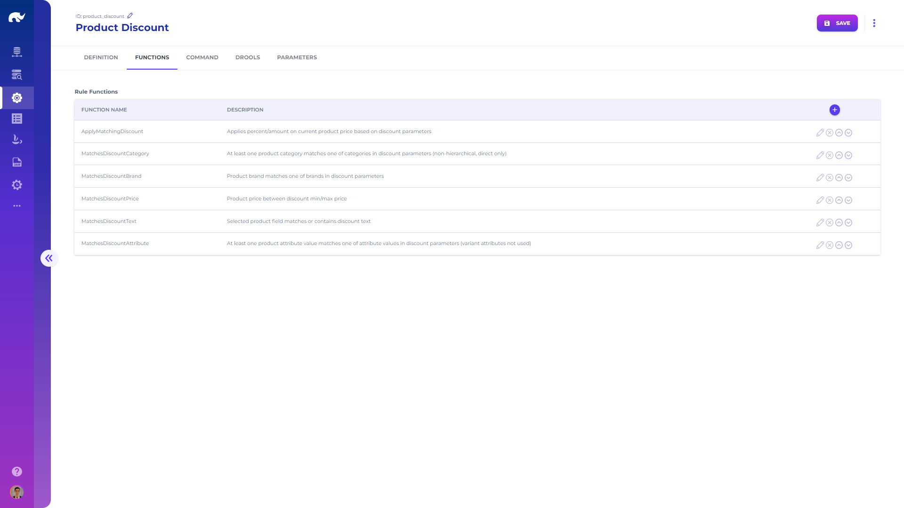
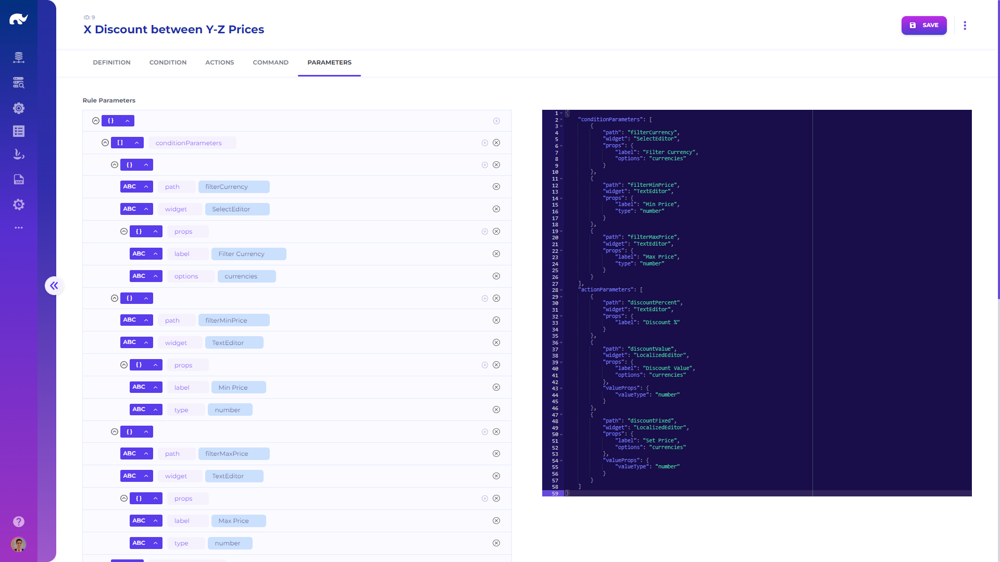

# Business Rules

Business rules are typically used by rule handlers such as [Drools](drools-rules.md).

## Rule Domains

Opening the **Rule Domain** screen from **Configuration** app menu or navigation bar, you will come across a specialized editor, allowing design of new rule domains.

Rules are grouped under "Rule Domains", which specify a set of rules which are evaluated together (such as discounts for a product or promotions for a basket). Rule domains share the following attributes:

* **Name:** Descriptive name of the rule domain
* **Description:** Detailed description of the rule domain
* **Platform:** Target execution platform for the rules in a domain
* **Command:** Complete command, representing rule domain functions and all the rules in a domain
* **Functions:** List of functions and their definitions which can be used across all rules in a domain
* **Parameters:** Additional platform specific parameters

## Rules

Rules inside a domain have the following common attributes:

* **Name:** Descriptive name of the rule
* **Description:** Detailed description of the rule
* **Status:** Whether the rule is currently applied or not
* **Condition:** Condition for qualifying for the rule
* **Actions:** List of actions to apply if the rule conditions are met
* **Command:** Full command body for the rule (to use instead of condition and actions)
* **Parameters:** Additional platform specific parameters
