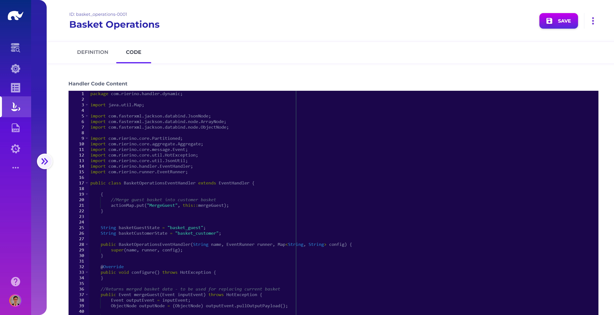
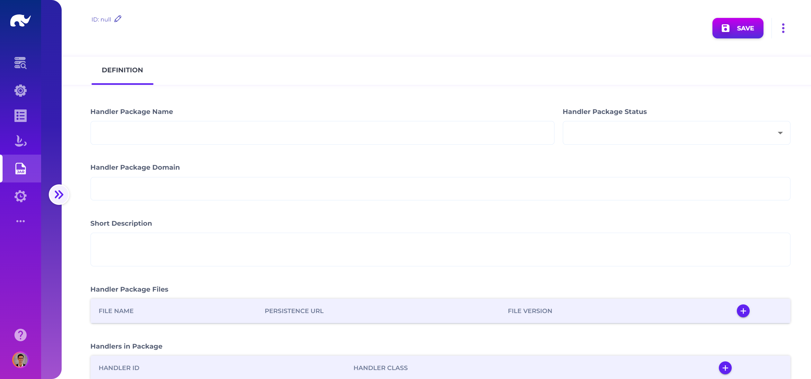

# Dynamic Handlers

Dynamic handlers are typically facilitated by code or package handlers such as [OpenHFTEventHandler](/broken/pages/Hfwxb76TXmG73YeRjSSY), [ScriptLoadedEventHandler](/broken/pages/nu3R4vUYzNbUuyXTQKuc) or [JarLoadedEventHandler.](/broken/pages/0DaLwUvznsjitTQJKbDs)

## Handler Codes

<figure><figcaption>
Handler Code UI
</figcaption></figure>

Handler codes are code blocks which are compiled dynamically at run-time for highly specialized operations which can not be addressed with available event handlers. Handler codes have the following attributes:

* **Name:** Descriptive name of the code
* **Status:** Whether code is currently active or not
* **Description:** Detailed description of what the code does
* **Domain:** Domain of the code which allows deploying multiple codes using a single code handler
* **Engine:** Language / scripting engine to use (e.g. html, java)
* **Code:** Full script or class implementation body

For Java codes, additional attributes are applicable:

* **Class:** Fully qualified class name to be assigned to the code
* **Dependencies:** Extra jar files which shall be retrieved and deployed when compiling the code
* **Code:** Full Java class extending com.rierino.handler.EventHandler, including actionMap mappings to functions

## Handler Packages

<figure><figcaption>
Handler Package UI
</figcaption></figure>

Handler packages are JAR packages of handler classes which are loaded dynamically at run-time, for use cases that are similar to handler codes. Handler packages have the following attributes:

* **Name:** Descriptive name of the package
* **Status:** Whether package is currently active or not
* **Description:** Detailed description of what the package does
* **Domain:** Domain of the package which allows deploying multiple packages using a single package handler
* **Files:** Jar files included in the package with Urls to download them (see [Custom Development](/broken/spaces/bkSulhvpxVy8S76n8DOO) for details)
* **Handlers:** Mapping of unique handler ids to fully qualified class names for handlers included in the package
