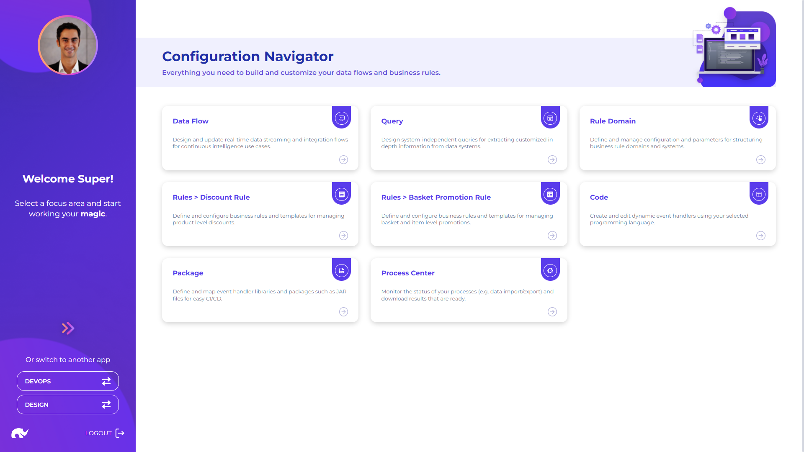

# Overview

Configuration app provides access to key features for designing, deploying and controlling all data processing logic and building blocks.

These capabilities are grouped under following main categories:

* **Queries:** Key capabilities for defining parameterized queries on data sources
* **Business Rules:** Key capabilities for designing business rule system and templates
* **Dynamic Handlers:** Key capabilities for integrating handlers that can be modified during run-time &#x20;
