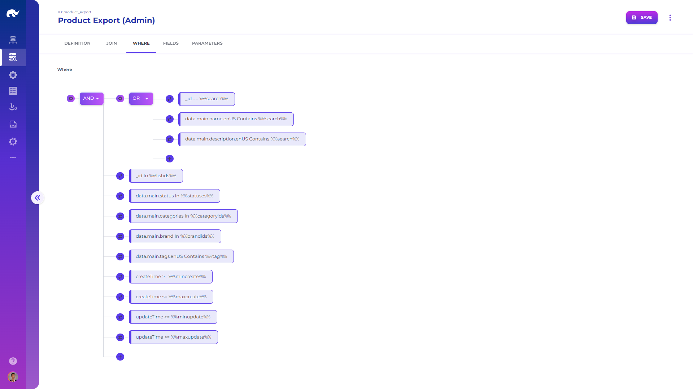

# Queries

Opening the **Query** screen from **Configuration** app menu or navigation bar, you will come across a visual query editor, allowing design of new queries.

Queries are mainly used by [Query Managers](../../devops/microservices/elements/query-managers/) in extracting specific data from different platforms.

Following attributes are used for all query types:

* **Name:** Descriptive name for the query.
* **Description:** Detailed description for the query.
* **Type:** Type of the query.
* **Status:** Whether the query is currently active or not.
* **Platform:** Target execution platform for the query.
* **From:** Main data source (e.g. table) for the query.
* **As:** Alias for the main data source.
* **Parameters:** Platform specific parameters for the query.
* **Inject:** Whether query should be injected with variables or not.
* **Required Variables:** List of mandatory variables for the query to execute (others will be considered optional and omitted if missing).


It is possible to make any query filter optional based on a condition (such as type='1'), by adding a transformation step and removing/adding a conditional variable  (e.g. {type1: (type=='1' || null)}) and using this variable as a required variable.



See [injecting variables](../../devops/api-flows/injecting-variables.md) for creating dynamic queries using variables.

