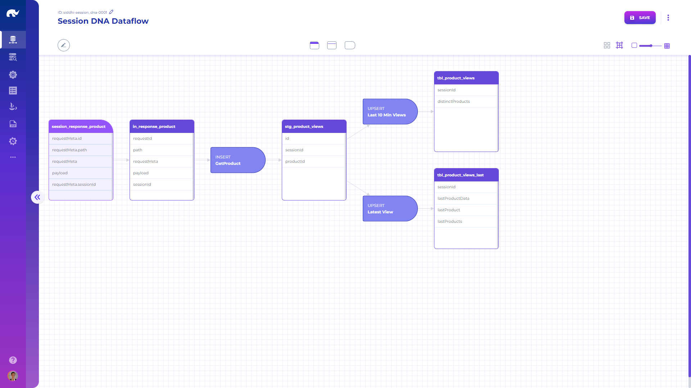

# Complex Event Processing

Data flows are typically used by data flow handlers such as [JsonSiddhiEventHandler](/broken/pages/DkSrF2iIprUTYDcbgTeJ).

Data flows share the following attributes:

* **Name:** Descriptive name of the data flow
* **Description:** Detailed description of the flow
* **Domain:** Business domain / group for the data flow
* **Platform:** Target execution platform for the data flow
* **Command:** Complete platform specific command for the data flow definition
* **Parameters:** Additional platform specific parameters

Data flows consist of mappings between data sources and tables through mutations.

## Data Sources

Data sources define origins (such as streams) from which data is fed into data flows. These sources share the following attributes:

* **Name:** Name of the source (such as Kafka topic)
* **Description:** Detailed description of the source
* **For Each:** Expression for repeating / denormalizing data from the source during feed
* **Fields:** Mapping of Json paths of data in source to target fields
* **Target:** Name of the target table for feeding from the source
* **Parameters:** Additional platform specific parameters

## Tables

Tables define data stores, which are used as destinations from data sources and mutations, as well as the origins for queries. These tables share the following attributes:

* **Name:** Name of the table
* **Description:** Detailed description of the table
* **Type:** Platform specific type of the table
* **Fields:** List of table fields and their types
* **DDL:** Platform specific statement for creating the table
* **Parameters:** Additional platform specific parameters

## Mutations

Mutations define transformations of data between and on different tables (e.g. delete, insert operations). These mutations share the following attributes:

* **Name:** Name of the mutation
* **Description:** Detailed description of the mutation
* **Type:** Type of the mutation (DELETE, INSERT, UPDATE, UPSERT, COMMAND)
* **Target:** Name of the target table for the mutation
* **Query:** [Query](../../configuration/queries/) to apply on the target table
* **Command:** Platform specific command for the mutation (if type is COMMAND)
* **Priority:** Execution priority for the mutation
* **Set Fields:** Field mappings from query results to target, if different than query field names
* **Parameters:** Additional platform specific parameters
