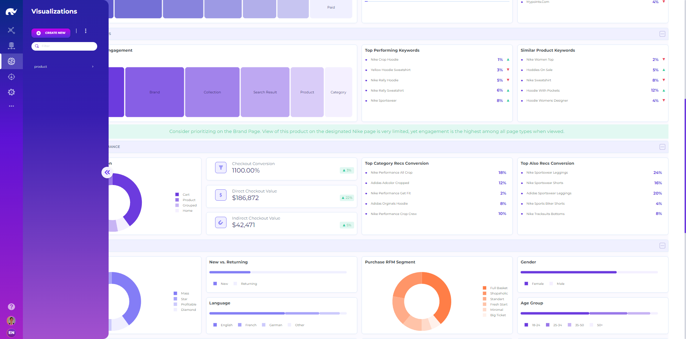

# Data Visualizations

<figure><figcaption>
Visualization UI
</figcaption></figure>

Data visualizations can be used to create embedded dashboards triggered through the "brain" menu on any screen. Each visualization includes a visual layout design and APIs linked as sources for providing data to each chart / table, etc.

It is possible to design full layout using visualization widgets, each with the following details:

* **Component Type:** Defines the widget to use.
* **Component Props:** Component type specific properties (such as plotly config and contents).
* **Source Query:** Alasql statement for populating widget data from source tables.
* **Sample Data:** Temporary data to use for testing visualization before connecting with sources (optional).
