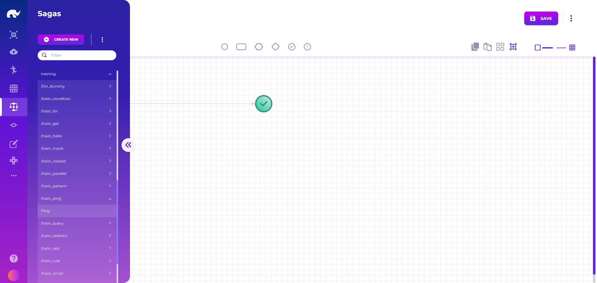

# GenAI Models

<figure><figcaption>
GenAI Model UI
</figcaption></figure>



GenAI model definitions allow configuration of AI agents and general purpose LangChain models using different providers such as Amazon Bedrock, Anthropic, Azure, Google Gemini, Mistral, OpenAI, as well as local LLM models.


To enable use of AI agents on a runner, you can simply add GenAI base runner to its configuration, set your API Keys for your preferred LLM provider in secrets and start allowing specific GenAI models to be executed on that runner.



Using AI agents on a runner increases its memory requirements, with minimum requirement becoming 1024mb.&#x20;

To keep out of box runners lightweight, GenAI base runner is not added to them by default (even for core and training runners), which can be added after initial installation as preferred.

It is recommended to keep AI agents running on dedicated runners, if possible, as they can increase build time and consume more resources than the rest of event handlers on the runner.&#x20;


All agents generated using this approach can be governed by RBAC and corporate governance rules, based on access rights of the users interacting with the agents.

Initial definition of a GenAI model includes 4 main tabs:

### Definition

* **Name:** A descriptive name
* **Version:** Current version of the model
* **Domain:** Business domain for grouping of the model
* **Allowed For:** List of runners which can provide the AI agent
* **Tags:** Descriptive tags for the model
* **Status:** Whether this model should be deployed or not
* **Instructions:** Instructions to send to agent for its initialization (such as main purpose and persona), allows using Handlebars templates for dynamic contents, with:
  * **Templated Instructions:** When set to true, it replaces Handlebars curly bracket contents with user & request data
  * **Template Input Saga:** If template requires backend logic beyond request event payload, allows using an existing saga for enriching the template input (saga output becomes the template input data)&#x20;
* **Call Path:** URL path to use for calling this agent directly from admin UI
* **Definition Path:** URL path to use for getting information about this agent directly from admin UI

### Model

* **Provider:** LLM provider that will be used by the agent
* **Memory Name:** State manager which will be used as the chat memory by the agent (distributed states for distributed agents)
* **Memory Size:** Maximum memory size to be kept for chat history
* **Parameters:** Model level parameters specific to LLM provider, including sagas that are allowed access for the AI agents as tools

#### Out of Box LLM Providers

Following chat models provide access to common LLM providers as well as local LLM models:

* AnthropicChatModel
* GitHubModelsChatModel
* GoogleChatModel
* HuggingFaceChatModel
* LocalAiChatModel
* MistralChatModel
* OllamaChatModel
* OpenAiChatModel
* OpenAiResponsesChatModel
* VertexAiChatModel
* WorkersAiChatModel

#### Flows as Custom Models

In addition to out of box LLM providers (such as OpenAI, LocalAI, etc.), it is possible to implement fully custom LLM chat models using Saga flows. SagaChatModel class provides this ability to use an existing Saga as an LLM model, which can make calls to external APIs or use custom local logic to respond to chat requests. This model has the following parameters:

* **Saga:** ID of the saga to use for the chat
* **Handler:** Alias of the saga event handler (defaults to "saga")

Saga flows are expected to return "response" in event payload as the response from the model.

### Toolkit

* **Tool Sagas:** List of sagas that can be executed by the agent for custom business flows & logic, which allows agents to have access to all capabilities available within Rierino
* **Tool States:** List of state managers that the agent is allowed to use for read and/or write operations (individual actions such as Delete can be also disabled)
* **Tool Systems:** External systems that the agent is allowed to interact with, automatically discovering endpoints from Open API specification of the target system and using already configured authentication logic
* **Tool Things:** Web of things that the agent is allowed to control, automatically discovering properties and actions from WOT discovery endpoint, using already configured 'thing' state or given inline 'thing' definition
* **Tool Scripts:** List of programming languages the agent is allowed to use for creating custom scripts and executing them on the fly (such as for data transformations or calculations)
* **Tool Governance:** Guardrails which allow smaller LLM models to be used with tools without risking tool looping and similar scenarios
  * **Max Tool Calls:** Soft limit on tool calls allowed inside a request, returning message to agent to stop using tools
  * **Exit After Tool Calls:** Hard limit on tool calls allowed inside a request, halting process
  * **Restrict Tool Repetition:** Whether same tool call with same parameters is allowed
  * **Tool Repetition Scope:** Scope of assessing whether same tool call is happening


For RBAC to specific tools by different user roles, Tool Sagas provide the most flexibility (and can be used to implement all other types of tools). As a rule of thumb, it is recommended to use other tool types for resources which are accessible by all users of the agent, and switch to sagas for granular access control.


### Interactivity

#### Structured Prompts

* **ID:** Unique identifier of the prompt used when calling AI agent
* **Name:** Descriptive name of the prompt
* **Description:** Detailed description of the prompt and its use cases
* **Template:** Handlebars template for producing prompt with given structured inputs

#### Interfaces

* **Use Interfaces:** Whether agent is allowed to send responses as UI forms instead of plain messages
* **Interfaces:** List of UIs the agent can use in communications
  * **ID:** Unique ID given to the UI
  * **Name:** Descriptive name of the UI
  * **Description:** Description for agent to understand use case of the UI
  * **Schema:** JSON schema of the data to be populated by the agent to display in UI
  * **UI:** Actual UI design for displaying or collecting information by the agent
  * **Actions:** API calls UIs can trigger for backend actions

It is possible to add Handlebars elements to interfaces that display customized HTML contents and provide interactivity with the AI agent through data entry and clicks:

#### On Click Events

The following attributes can be added to a DOM element to make it clickable in Handlebars templates:

* **data-event:** Event to be triggered when the element is clicked
* **data-params:** Parameters to send to "data-event" that is triggered, defined as a valid JSON entry (e.g. '"text"', '123', '{}')

Common event types used are as follows:

* **messageAI:** Creates and sends a new message to the agent as a new request or response. data-params can be either:
  * A string entry defining the complete text to send (e.g. '"Hello"')
  * An object with reference to an agent prompt (e.g. '{ "prompt": "request-detail", "extra": {"id": "123"} }')
  * An object with reference to an interface API action (e.g. '{ "api": "add-to-favorites", "extra": {"id": "123"} }')&#x20;
* **set:** Sets the value of a variable, which is typically sent later in AI messages, with data-params as:
  * &#x20; An object with reference to the path and value to set (e.g. '{ "path": "quantity", "value": 2 }')

#### On Change Events

Regular Rierino [widgets](../../design/user-interface/uis/widgets/) automatically set input parameters when their values change, using their path attribute, without any additional configurations. But, for custom input elements embedded into Handlebars templates, it is possible to use "data-change-path" attribute to automatically pass data updates to be used in AI messages.

### Guidance

* **Welcome Message:** First message displayed when user selects the AI agent
* **Capabilities:** List of tools and skills that are supported by the agent, used for descriptive purposes
* **Dialog Starters:** Predefined list of prompts which can be used with a single click to populate prompts on AI agent screen
