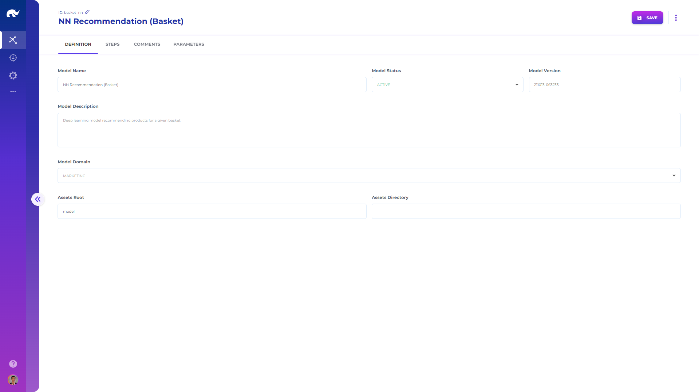

# ML Models

Model definitions allow reuse of data science libraries and model classes, running algorithms with different set of inputs and parameters.

Initial definition of a model includes:

* **Name:** A descriptive name
* **Description:** Detailed description of the model
* **Tags:** Descriptive tags for the model
* **Status:** Whether this model should be deployed or not
* **Version:** Current version of the model, which is used for deciding whether real-time model handlers need to update their current assets or not
* **Domain:** Categorization of the model based on business domain
* **Assets Root:** Root path in file system for storing and retrieving saved model assets
* **Assets Directory:** Directory under root for saved model assets
* **Scheduler:** Scheduler to use for regular training or execution of the model (e.g. Airflow)
* **Schedule Status:** Whether schedule is currently active or paused
* **Comments:** Historical list of comments, which typically includes information on model update reasons or findings
* **Parameters:** Model level parameters which can be for training or inference purposes

Each model consists of a series of steps, which allows building sequential model pipelines, although most models may consist of a single step. Initial definition of a step includes:

* **Id:** Unique identifier for the step
* **Name:** A descriptive name
* **Description:** Detailed description of the step
* **Has Assets:** Whether step has stored assets or not
* **Assets Root:** Root path override for the model assets root
* **Assets Identifier:** File name for the step assets

Steps also have parameters that are defined in a very dynamic manner to allow configuration of all model types, and may include input, output, training details as well as the class and package names for Python libraries.
