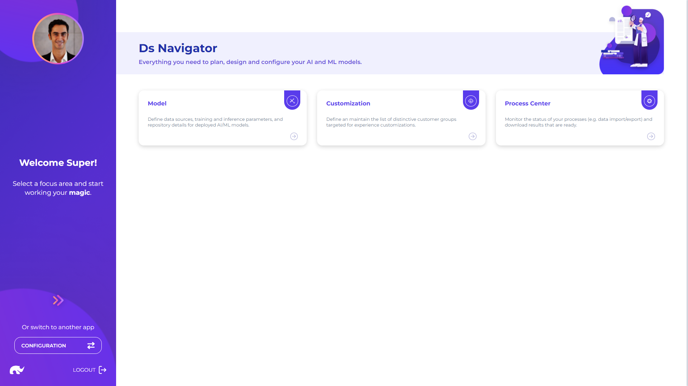

# Overview

Data Science app provides access to key features for configuring ML/AI model parameters, which can be deployed with batch or real-time API processes.

These capabilities are grouped under following main categories:

* **Models:** Key capabilities for configuring [ML model](ml-models/) parameters
* **Data Flows:** Key capabilities for defining data integration flows, mainly for real-time ELT
* **Customizations:** Key capabilities for defining personalization groups
