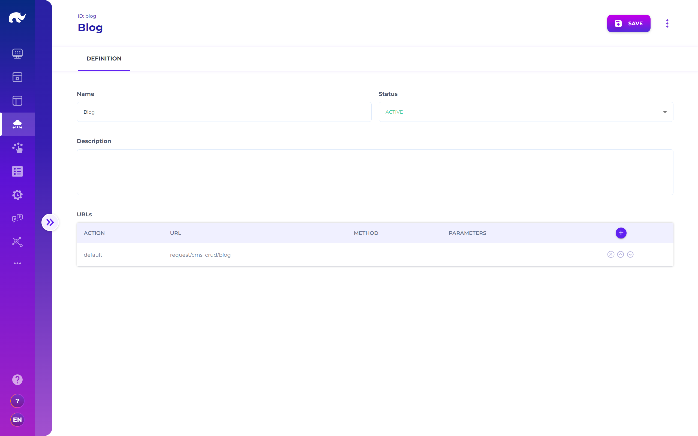

# API Mapping

Sources are optional configurations, which allow linking UI screens to alternative APIs for listing, viewing and editing data sources.

Sources are mapped to UI screens through their ids (i.e. a UI record should have the same id as its source record). When a UI screen does not have a matching source, it automatically links itself to the crud endpoint of admin API gateway. If you are using only the core runners and endpoints for simple CRUD operations, this means that you do not need to manage source entries.

However, a source record would be necessary under one of the following circumstances:

* If you've create and are using a a runner other than the admin core CRUD runner for managing specific records - in this case you can create a source with "default" action mapped to your runner's url, such as "request/pim\_crud/product"
* If you are using the query table lister, or another lister with a special query designed for listing / paginating records - in this case you can create a source and add a "list" action mapped to your query API endpoint, such as "request/pim\_rpc/GetProductsForSeller"
* If you would like to disable certain operations, such as PATCH - in this case, you can create a source and add the related action with method set as "NOOP"

If one of these apply to your case, you can map URL endpoints for different actions with the following settings:

* **Action:** "default", "post", "put", "patch", "delete", "get", "list" or "query", defining which operation to map to given URL. When an action is not defined, it uses "default" action's URL with its own http request method (e.g. DELETE for "delete").
* **URL:** URL path on the API gateway, after the "/api/" section (e.g. request/crud/variable).
* **Method:** Http request method to use for the action (e.g. POST, GET).
* **Parameters:** "body", "url" or "query", defining where to send the parameters (e.g. id of the record for GET) for the action.
* **Extra Body:** Extra json body to include in request (e.g. a filter value to pass on). Extra body is sent in body or query based on the parameters configuration.

When a source is not defined for a UI, it uses default CRUD endpoint for the admin core services, which is typically only used for Rierino platform's internal states.

Sources also have "write branched" property, which is used for tagging sources that should be applying branch logic before saving records (which is already available for predefined branched sources like sagas and queries).

## Concurrent Updates

Sources have a "Validate Version" parameter, which allows handling conflicts in case of concurrent write operations. To enable handling of such conflicts:

* Target state manager should have validate.instanceVersion parameter set to true (default value).
* Source in design application should have "Validate Version" set to true.

In this scenario, the UI sends an incremented instanceVersion value to the backend for write operation, and if this incremented value is not a valid update version, it is rejected by the backend. The front-end displays an option to "Cancel", "Force Update" or "Merge" selected updates with the latest record in this case, allowing user to handle conflict in preferred manner.
