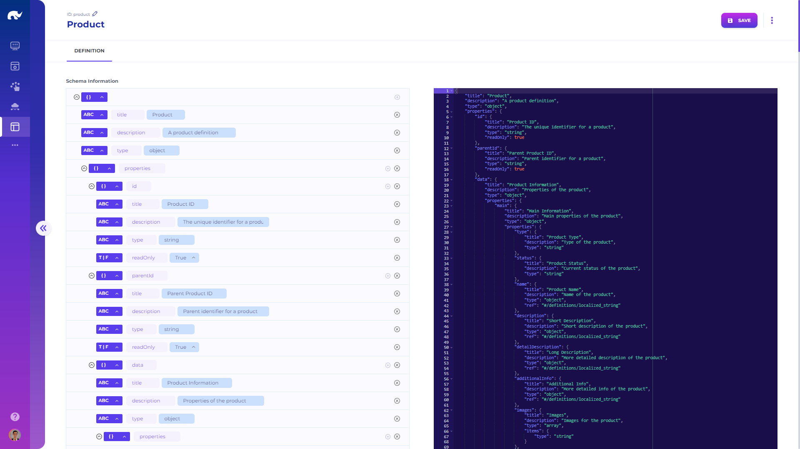

# Data Schema

As the UI screen allows designing visual structure of forms and lists, the schema screen allows designing the underlying data structure. When using a schema-free no-SQL database, this is not strictly necessary, but is always recommended to have a reference for data model design.

Rierino uses [JSON schema](https://json-schema.org/) as a standard for structuring data format for different record types, with [extensions](../../extensions/json-schema-extensions.md) for more advanced use cases. These schemas are also used for defining validation rules (e.g. required fields, minimum length), which are automatically used in UI screens to display warnings to users.

If you define a schema that has the same id as a UI screen, the screen automatically uses this schema for populating its editor labels as well as validation rules. It is also possible to select a different schema for a given UI from its design screen.

Rierino schemas also allow use of "ref" attribute, for referencing other schema names when settings can be reused across different record types. For example, if you create a multi-language string schema with "localized\_string" id, you can reuse it within the attributes of a "name" element, which will automatically copy its contents.

The structure of data schema (except for those used only for reference or customized with read only elements) always follows [aggregate data model](../../devops/microservices/elements/state-managers/state-data-structure.md) (i.e. with id, data).


Json Schema Page



Schemas are used together with UI definitions to automatically populate Admin apps, and can be utilized in data validation using related condition evaluators or state manager validators.

