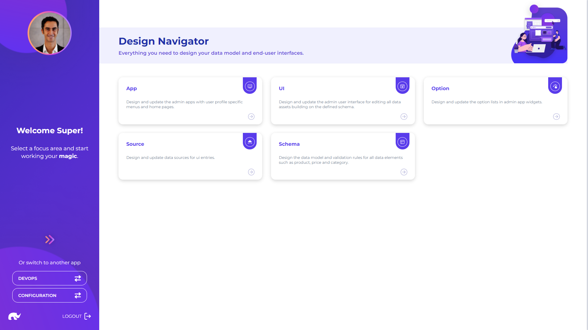

# Overview

Design app provides access to key features for designing, deploying and controlling all admin user interface building blocks.

These capabilities are grouped under 3 main categories:

* **User Interface:** Key capabilities for visualizing and editing data
* **API Mapping:** Key capabilities for linking user interface to backend APIs
* **Data Schema:** Key capabilities for structuring data
