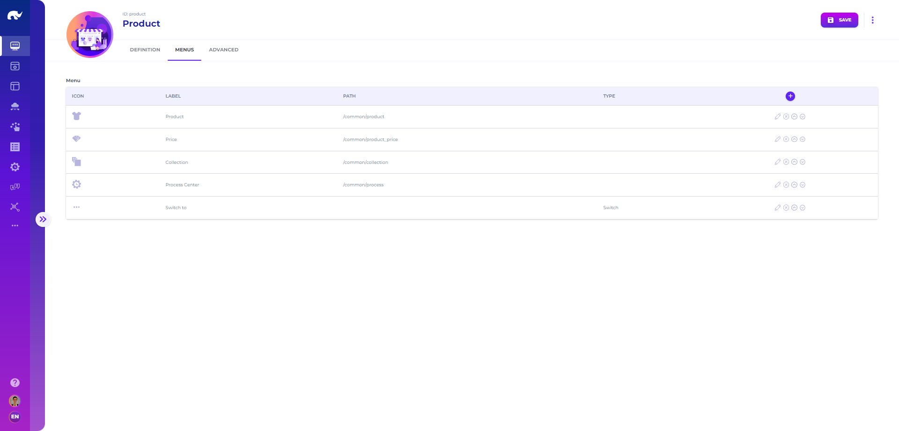

# Apps

Opening the **App** screen from **Design** app menu or navigation bar, you will come across a form, allowing design of new apps and navigation menus.

Apps are listed on the left side of this screen. The app screen has similar functionalities as any other UI screen, such as save, delete, duplicate, item import and export actions and menus.

On top of this screen, you will notice that the app ID is editable, this allows you to assign a meaningful unique ID to each app for your reference. Since these IDs will be used in url path for accessing the app, this approach makes them more manageable than assigning random or sequential IDs.

The definition tab allows design of the app home page, with its image, title and description. Additionally, it is possible to select an API endpoint as the landing template path, which allows loading handlebars template to render a fully customized landing page for the app.

Definition tab also includes custom configuration for accessing help documents related to this app:

* **Help URL:** This is the URL to direct user to when help link is clicked. If the URL is partial (e.g. /design), it uses HELP\_URL environment variable as the base. Otherwise, the full URL provided is used.
* **Help Space & Organization:** If HELP\_TOKEN environment variable, which is the API Token required for accessing GitBook search APIs, these fields allow restriction of search results to a specific GitBook space or organization. If HELP\_TOKEN is defined, clicking on the "?" icon opens a search dialog instead of automatically directing user to the help URL.

The menus tab allows editing navigation and home page contents, by defining different UI screens which should be accessible from this app.

## Menu

Each app also has a menu, which configures the list of links on home page, the navigation bar and the list of URLs a user can use:

* **Label:** Short text to display as label
* **Icon:** Name of icon to display for the link
* **Description:** Detailed description for the link (displayed on home page)
* **Type:** Type of the menu entry ("Link" for direct links, "More" for grouping links, "Switch" for app switch menus)
* **On Landing Page:** Whether the screen should be displayed on Rierino landing page as well
* **Hide on Branch:** Whether the screen should be hidden on non-main branches

## Menu Types

### Common

Directs user to a specific UI screen:

* **Screen:** Id of UI screen to direct user to

### HTML

Directs user to a custom HTML page with the body defined as:

* **Screen:** Page URL to display HTML contents on (e.g. home displayed on /html/home path)
* **Contents:** List of html contents to include with source, path, parameters or html data fields
* **Metas:** List of \<meta> tag definitions with tag specific attributes
* **Links:** List of \<link> tag definitions with href, rel and other link contents
* **Styles:** List of \<style> tag definitions with html data field for style body
* **Scripts:** List of \<script> tag definitions with tag specific attributes (and optional html data field for script body)

### Hosted

Directs user to a custom coded page, which uses React components.

* **Code:** ID of hosted page code to use for rendering this page.

### DV

Directs user to an embedded dashboard page defined with:

* **Screen:** Id of data visualization to display
* **Function:** Data visualization function parameters, same as editor function menus

### Custom

Directs user to a custom design screen:

* **Screen:**
  * **command:** For sending runner related commands through API gateway
  * **message:** For sending event streaming messages to API gateway
  * **openapi:** For displaying automatically generated OpenAPI documentation
  * **aiagent (deprecated):** For navigating to AI Agents configured for the app&#x20;

### File

Displays bulk file listing and upload screen, using same configurations as media editors.

### More

These menu entries are used for grouping similar links, which appear as a drop down menu on navigation bar. All grouped links share the same icon on app main page and navigation bar.

* **Paths:** Sub-entries for the menu entry with label, type, screen, description data fields

### &#x20;Switch (Deprecated)

These menu entries allow switching to other apps.

* **Paths:** Sub-entries for the menu entry with label, path (e.g. /app/design) data fields

## Preferences

It is possible to define preference options for users to select within an app, which is stored during their session and can be used for applying default filters (such as language, country) across UIs of the app.

## AI Agents (Deprecated)

Apart from the menus, apps allow configuration of AI Agents, by providing the following details:

* **ID:** ID assigned to the [GenAI model](../../data-science/genai-models/) configuration
* **Name:** Name to be displayed for selecting the agent
* **Call Path:** API path for sending messages to the agent
* **Definition Path:** API path for getting description & tools of the AI agent

AI Agents become accessible with a Custom menu of "aiagent" screen type.

<figure><figcaption>
AI Agent Screen
</figcaption></figure>


In more recent versions, AI agents are listed globally, allowing users to interact with different agents without the need to switch between apps.

