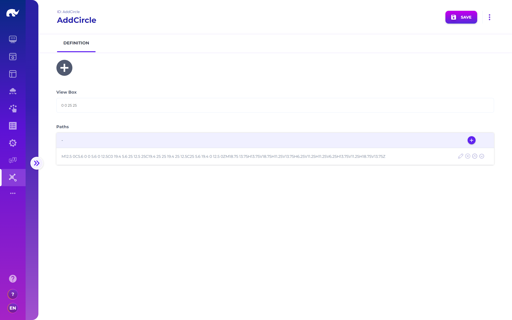

# Icons

<figure><figcaption>
Icon UI
</figcaption></figure>

Icons can be defined with the following configurations:

* **ID:** ID of the icon for reference (used by widgets)
* **View Box:** View box attribute to use for the SVG
* **Paths:** List of "d" and additional props (e.g. "fill") to produce \<path> segments for the SVG


All icons are available as SVG files from /api/icon/\[name].svg path for consumption in different platforms as well.



A special Paste SVG menu action is available for icons, which allows automated conversion of a copied regular SVG content to an icon.

