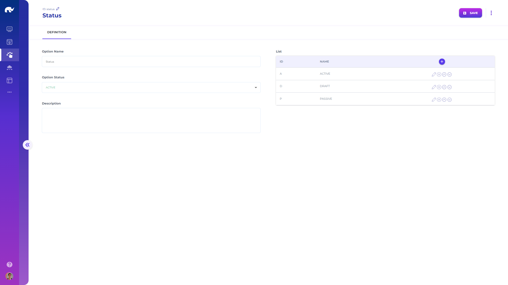

# Options

Options can be defined with the following configurations:

* **ID:** ID of the option for reference (used by widgets)
* **Name:** Descriptive name of the option
* **Description:** Detailed description of the option
* **List:** List of option values and their properties (e.g. color, icon)
