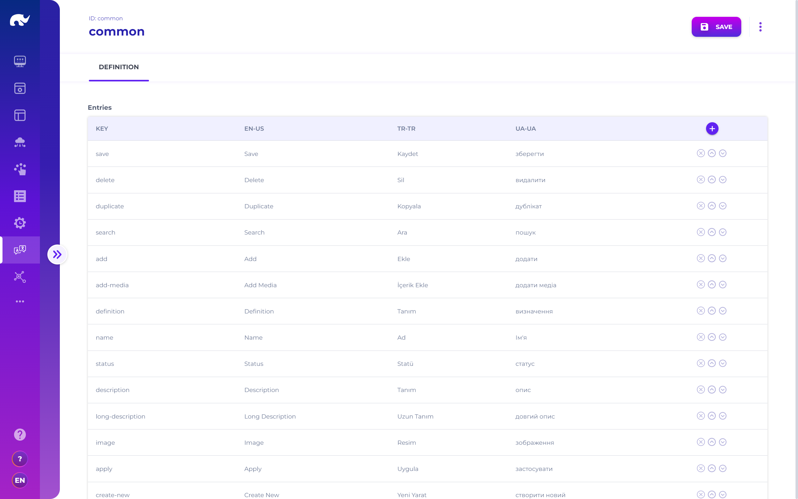

# Translations

<figure><figcaption><p>Translation UI</p></figcaption></figure>

Translations can be defined with the following configurations:

* **ID:** Unique identifier for the translation [domain ](#user-content-fn-1)[^1]\(e.g. common, product)
* **Entries:** List of translations for the given domain
  * **Key:** Unique identifier for the translation key (e.g. save)
  * **\[locale]:** Matching translation for a specific locale (e.g. key=save, enUS=Save)&#x20;

## Error Messages

A special translation entry with id "error" is used for mapping errors received in API responses to rich content displayed on the user interface.

If the received error includes an error code in response such as standard Rierino [error codes](../../troubleshooting/error-codes.md), a translation entry with "CODE\_\[CODE]" key allows display of given message in error pop-ups. If no such entry is found, "message" field in error response is used as the message to display (which can refer to a dictionary entry as well).&#x20;

In both cases, the final message is also allowed to use Handlebars templates, for populating custom Markdown formatted error messages using "detail" field in error response, such as:

```markdown
**Validation Errors:**
{{#each errors}}
* {{getText title}}: {{getText message}}
{{/each}}
```


A special "getText" helper is available on these templates, allowing localization of data labels for current user language.


[^1]: Used for referring to individual entries as a prefix. For example a \{{common.save\}} entry refers to "save" key of "common" translation domain.

    When the prefix is ignored, such as \{{save\}}, always the "common" domain is used.
