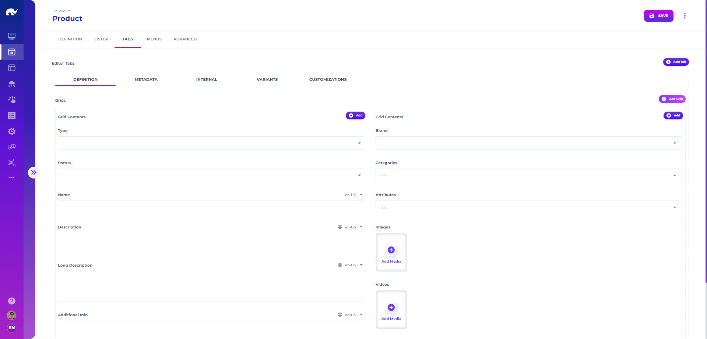

# UIs

Opening the **UI** screen from **Design** app menu or navigation bar, you will come across the interface for designing new UI screens, including implementation of all data listing and entry forms across different apps.

Rierino data entry forms use a tab & grid system, where each screen has one or more tabs, each tab contains one or more grids and each grid contains one or more editor widgets. These contents are edited using a responsive "click-to-add" approach, where you have the option to add tabs, grids and editors via buttons, instead of a "drag-and-drop" approach, for standardization and automated alignment of all editors.

It is possible to change the contents, layout, look and feel of all components using these configurations.

## Common Configurations

* **ID:** ID of the UI for reference (should match schema id)
* **Name:** Descriptive name of the UI
* **Status:** Whether UI should be active or not
* **Description:** Detailed description of the UI
* **Schema:** Id of the data [schema ](../../data-schema/)to use for visualization (defaults to UI id)&#x20;
* **Schema Path:** Json path of inner schema property to use for visualization, if not using root entry (e.g. properties.data.properties.steps.items)
* **Lister:** Type of lister to use for listing records (e.g. GroupedLister)
* **Lister Title:** Text to display on top of records listing
* **Favorites:** ID of the favorites to store user's favorited records in (favorites disabled if not provided)
* **Validated:** Whether data entries should be validated against their Json schema or not, which restricts user from saving data for [invalid data](#user-content-fn-1)[^1]
* **Read Only:** Whether editor allows saving updates or not
* **ID Field:** Json path for the id field of records (e.g. id)
* **Customizable ID:** Whether the user can edit record ids or not
* **Name Field:** Json path or [jmespath expression](#user-content-fn-2)[^2] for the name field of records for display (e.g. data.name)
* **Static Name:** Text to display on top of edited record
* **Icon Field:** Json path or jmespath expression for a record specific image to display on editor (e.g. data.image)
* **Static Icon:** Name of icon to display on top of edited record
* **Icon Field Base URL:** Base path for record specific images (e.g. http://example.com/media)
* **No Buttons:** Whether to disable editor save button or not.
* **No Menus:** Whether to disable all editor menus or not.
* **No Default Menu:** Whether default menu items (e.g. delete, duplicate) should be displayed or not.
* **Name Handle:** Handlebars template to use for displaying name on editor title.
* **Disable Save If No Changes:** Disables save button if no data change is observed on the current record.
* **No Confirm on Close:** Disables confirmation dialog which is displayed if the contents have changed since last save before closing
* **Close on Save:** Whether the editor should be automatically closed after a successful save operation or not (applicable for dialog based editors).&#x20;
* **Close on Delete:** Whether the editor should be automatically closed after a successful delete operation or not (applicable for dialog based editors).&#x20;
* **Scroll Help:** Whether the editor should automatically display scroll to top/bottom buttons in case the editor grows beyond window height.

## Lister Configurations

Lister details can be configured by selecting lister type to use. See [Listers ](listers.md)for details.

## Tab Configurations

Editor details can be configured by adding/removing tabs.

* **Tab Label:** Label to display for a tab
* **Condition:** [Condition](extended-scope/conditional-display.md) for displaying the tab

Each tab can have one or more grids, where 2 grids (and the last single grid) cover the entire width of an editor.

A list of widgets added to a grid make up the editor contents, where each widget has its own specific set of properties:

* **Path:** Json path for the widget data ($ for reference to root element, also allowing a.b\[c.d] notation for fields with '.' character in name)
* **Condition:** [Condition](extended-scope/conditional-display.md) for displaying the widget
* **Widget:** [Widget](widgets/) for displaying and editing data (e.g. SelectEditor)
* **Properties:** Properties to pass on to editor widget (e.g. options)
* **Grid Properties:** Properties to pass on to grid of the editor (e.g. sm)
* **Value Properties:** Properties to pass on to the value children of editor widget (for widgets such as tables)
* **Value Menus:** List of action menus to be displayed for the editor widget (with configurations similar to editor and lister menus)

Widget specific properties for widgets packaged with Rierino platform are also listed in this section.


Only exception to these configurations is UI entries used for reference, with "uiDesignRef" configurations, which are allowed to have unstructured data for reference.


## Enrichment Configurations

These configurations allow enrichment of data received from backend and/or entered by the user, either as calculated fields or lookup results based on current form contents.

* **Default Item:** Default data to be used when creating a new record
* **Extra Path:** Json path to add extra data on (defaults to "extra")
* **Extra Data:** List of additional data elements to be calculated or queried for enriching current data contents (mapped on to the extra path)


Extra data contents are applied for display purposes only and are not sent back to the backend for CRUD operations unless users manually override them.


## Menu Configurations

These configurations define the list of functions available for lister / editor or field [menus](menus/), buttons and functions. It is possible to enable / disable default menus (e.g. save, delete) in addition to these custom entries.

* **Type:** Type of the menu function (e.g. wave, TranslateValue)
* **Icon:** Name of icon to display for the menu function
* **Title:** Title to display for the menu function
* **Properties:** Function specific parameters defined in Json form (e.g. route for wave functions)

### Reference Configurations

Reference configurations are used for creating partial UI designs which are typically used by dynamic object editors to render list of editors embedded inside different UIs and tabs.

[^1]: To display alerts on widgets for causes of validation errors, widget specific validated property can be used

[^2]: E.g. =lookup('ui', id).data.name
