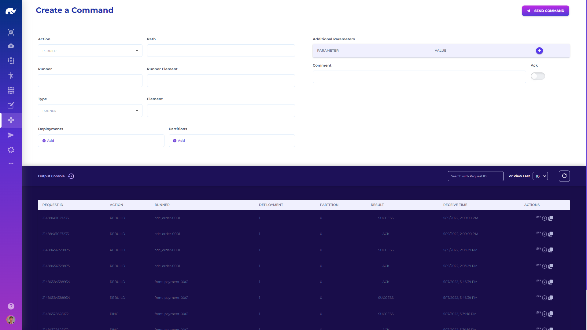

# Sending Commands

Command center allows issuing commands to runners and reviewing their responses.

A command consists of the following details:

* **Action:** Action to be executed by the runner or its elements
* **Runner:** Name of the runner (all runners if blank)
* **Type:** Target level of the action (runner, state, query or handler)
* **Element:** Name of the element to execute action (based on target level)
* **Deployments:** List of deployment versions of the runner that should respond
* **Partitions:** List of partitions of the runner that should respond
* **Additional Parameters:** Action specific parameters to apply (e.g. duration for PAUSE)
* **Comment:** Descriptive comment regarding the command for logging
* **Path:** Path to issue command on (if not on default command url)
* **Ack:** Whether runners should acknowledge receipt of the command before executing it

List of actions responded to at runner level are:

* PING: Runners should return received command as is
* REBUILD: Runners should rebuild their operational elements (which may have msecs of downtime)
* REMAP: Runners should remap their mapping elements (almost no downtime)
* PAUSE: Runners should pause their main threads for given "duration" of ms
* STOP: Runners should completely halt
* LOG: Deployments should change their logging level to given "level" (note that log levels are set for all runners inside the same deployment as a global setting, instead of at runner level)
* COMMIT: Runners should commit any outstanding buffers

For element level commands, refer to related element pages.

After issuing a command, it is possible to query the response to that specific command (specified by its request id) or view most recent responses from all runners.

Command output console allows copying full responses as Json, as well as copying contents of a previous command for repetition.


In order to have all runners respond to commands, each runner configuration should have command role and stream defined.

