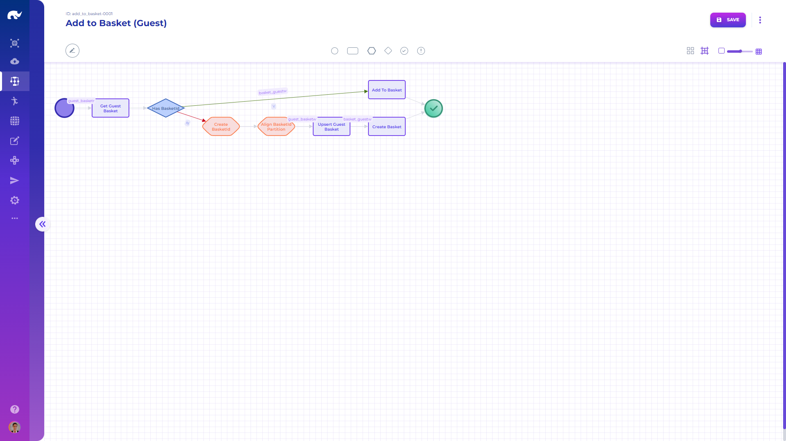

# API Flows

A saga is Rierino’s orchestration layer for APIs and backend processes. It turns a trigger (usually a URL path) into an executable step graph.

Each saga step can run on the same runner or a different runner. This lets you combine microservices and shared logic into one flow. You build sagas with drag-and-drop steps and explicit success/fail routing.

Common use cases include API composition, validation, caching, and resilience. You can also run sagas on schedules or as “fire & forget” tasks.


Changes in a saga flow or creation of a new saga are deployed in real-time, regardless of how distributed the saga event runners are.

