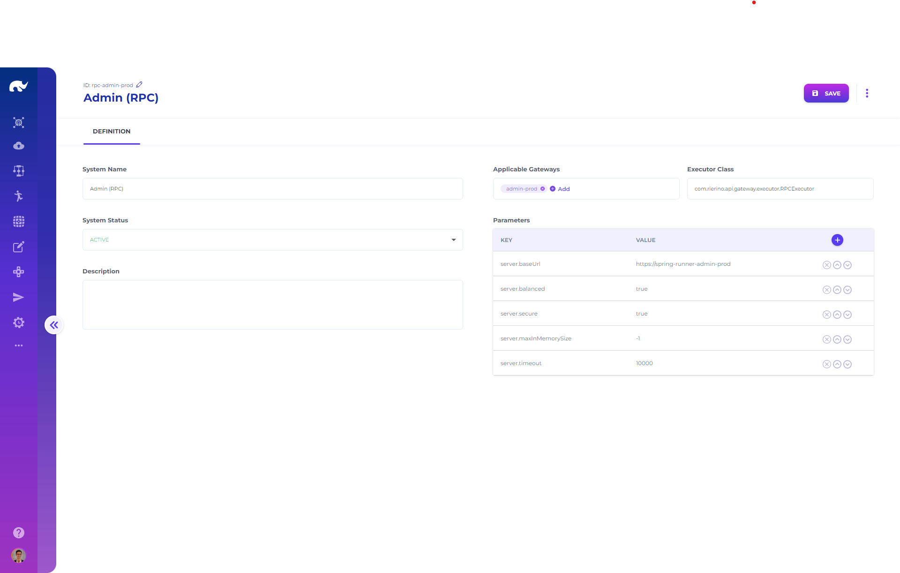

# Gateway Systems



All systems share the following settings, and additional parameters apply for the selected executor type:

* **Executor:** Fully qualified class name for the executor responsible for communicating with this system.
* **Gateways:** List of gateway ids which are allowed to communicate with this system.

All systems have the following parameters applicable:

| Parameter                | Definition                                                   | Example         | Default |
| ------------------------ | ------------------------------------------------------------ | --------------- | ------- |
| logging\_service         | Name of the Kafka service for logging requests and responses | kafka\_logging  | -       |
| request\_logging\_topic  | Kafka topic to log requests                                  | request\_log    | -       |
| response\_logging\_topic | Kafka topic to log responses                                 | response\_log   | -       |
| tracking\_service        | Name of the Kafka service for recording tracking data        | kafka\_tracking | -       |
| tracking\_topic          | Kafka topic to record tracking data                          | tracking\_log   | -       |

It is possible to define any number and type of new gateway systems with specialized configurations, and typical gateway system types deployed with Rierino are as follows:

## RPC Based Gateway System

With a specific executor (_com.rierino.api.gateway.executor.RPCExecutor_) this gateway system is used for communicating with [RPCEventRunner](../../microservices/service-runners/deploying-runners/spring-runners.md#rpceventrunner) instances over http or https, with the following parameters:

| Parameter                | Definition                                                                            | Example                          | Default |
| ------------------------ | ------------------------------------------------------------------------------------- | -------------------------------- | ------- |
| server.baseUrl           | URL applied as the base for all channels                                              | https://spring-runner-admin-prod | -       |
| server.balanced          | Whether executor should use client side load balancing (or use URL for direct access) | true                             | false   |
| server.secure            | Whether executor should use SSL                                                       | true                             | false   |
| server.mTLS.enabled      | Whether executor should use mTLS (requires [mTLS config](../dynamic-tls-and-mtls.md)) | true                             | false   |
| server.maxInMemorySize   | Bytes limit for buffering data in memory by web client                                | 16777216                         | -1      |
| server.timeout           | Milliseconds before the executor times out a request                                  | 10000                            | -       |
| server.connectionTimeout | Milliseconds before the executor times out a connection                               | 1000                             | -       |
| server.maxConnections    | Maximum number of connections to open                                                 | 100                              | -       |
| server.maxIdleTime       | Maximum connection idle time                                                          | 60000                            | -       |
| server.maxLifeTime       | Maximum connection lifetime                                                           | -                                | -       |
| server.header.\*         | List of headers to send                                                               | -                                | -       |
| server.cookie.\*         | List of cookies to send                                                               | -                                | -       |
| authenticated            | Whether target runner requires authentication or not                                  | true                             | false   |
| token                    | Static token to send for authentication                                               | -                                | -       |
| server.clientId          | Client id to send for authentication                                                  | gw                               | -       |
| server.secret            | Client secret to send for authentication                                              | secret                           | -       |
| server.tokenPath         | URL to use for issuing tokens for id & secret                                         | /IssueToken                      | -       |

### RPC API Flow

Exposure of RPC event runner APIs through these systems have the following flow in a standard K8s set-up:

<figure><figcaption><p>RPCExecutor to RPCEventRunner Flow</p></figcaption></figure>

* Installing a new deployment creates a private service endpoint accessible from within the K8s cluster through "http://runner-spring-\[deploymentId]-service.admin-backend.svc.cluster.local:\[port]".
  * \[deploymentId] can be seen from the related deployment's screen. In case this id includes "\_" character, it is replaced with "-" to comply with K8s path standards.
  * Default \[port] is 1235, which can also be changed to another port using parameters of the deployment definition.
  * This endpoint should be configured as the "server.baseUrl" for the created gateway system.
* All runners listed in deployment create new URL paths on this endpoint as "/api/\[runnerName]".
  * \[runnerName] is the name provided in the related deployment's definition as a mapping to a specific runner instance.
  * For each RPC runner in deployment, a new gateway channel should be created on the new gateway system. These channels are exposed as "/api/request/\[channelId]" URL paths on API gateway, where \[channelId] can be seen from the created gateway channel's screen.

With these configurations, sending requests to:

```url
[gatewayServiceUrl]/api/request/[channel1Id]/[sagaPath]
```

routes these requests to:

```url
http://runner-spring-[deploymentId]-service.admin-backend.svc.cluster.local:[port]/api/[runner1]/[sagaPath]
```

## CRUD Based Gateway System

With a specific executor (_com.rierino.api.gateway.executor.CRUDExecutor_) this gateway system is used for communicating with [CRUDEventRunner](../../microservices/service-runners/deploying-runners/spring-runners.md#crudeventrunner) instances over http or https. Parameters used by RPCExecutor are also applicable for this executor.

### CRUD API Flow

Exposure of CRUD event runner APIs through these systems is similar to RPC flows and have the following flow in a standard K8s set-up:

<figure><figcaption><p>CRUDExecutor to CRUDEventRunner Flow</p></figcaption></figure>

* Installing a new deployment creates a private service endpoint accessible from within the K8s cluster through "http://runner-spring-\[deploymentId]-service.admin-backend.svc.cluster.local:\[port]", same as the RPC API flow. In fact, it is possible to include both CRUD and RPC event runners within the same deployment package.
* All runners listed in deployment create new URL paths on this endpoint as "/api/\[runnerName]".
  * \[runnerName] is the name provided in the related deployment's definition as a mapping to a specific runner instance.
  * For each CRUD runner in deployment, a new gateway channel should be created on the new gateway system. These channels are exposed as "/api/request/\[channelId]" URL paths on API gateway, where \[channelId] can be seen from the created gateway channel's screen.

With these configurations, sending requests to:

```url
[gatewayServiceUrl]/api/request/[channel1Id]/[state]/[*id]
```

routes these requests to:

```url
http://runner-spring-[deploymentId]-service.admin-backend.svc.cluster.local:[port]/api/[runner1]/[state]/[*id]
```

## Kafka Based Gateway System

With a specific executor (_com.rierino.api.gateway.executor.KafkaExecutor_) this gateway system is used for communicating with runners such as [SyncSamzaEventRunner](../../microservices/service-runners/deploying-runners/samza-runners.md#syncsamzaeventrunner) and [AsyncSamzaEventRunner](../../microservices/service-runners/deploying-runners/samza-runners.md#asyncsamzaeventrunner) through Kafka streams, with the following parameters:

| Parameter          | Definition                                           | Example                  | Default |
| ------------------ | ---------------------------------------------------- | ------------------------ | ------- |
| bootstrap\_servers | Default Kafka bootstrap servers                      | kafka.example.com:9092   | -       |
| timeout            | Milliseconds before the executor times out a request | 10000                    | -       |
| topic\_response    | Kafka topic to receive responses on                  | response\_product        | -       |
| producer.\*        | Any Kafka producer parameter                         | linger.ms=0              | -       |
| consumer.\*        | Any Kafka consumer parameter                         | group\_id=store\_product | -       |

### Kafka API Flow

Exposure of Samza event runner APIs through these systems have the following flow in a standard K8s set-up:

<figure><figcaption><p>KafkaExecutor to SamzaEventRunner Flow</p></figcaption></figure>

* Installing a new deployment initializes its list of runners which start listening to their configured Kafka topics.
  * Each runner listens to a \[request] topic (e.g. request\_product), which is typically configured as its dedicated stream for receiving requests from the gateways.
  * After completing its process, the runner returns its results on a \[response] topic (e.g. response\_store). Multiple runners can share the same \[response] topic.
* Kafka topic which returns responses from target runners should be configured as "topic\_response" for the created gateway system.&#x20;
* For each Samza runner in deployment, a new gateway channel should be created on the new gateway system with target set as the \[request] topic of the related runner. These channels are exposed as "/api/request/\[channelId]" URL paths on API gateway, where \[channelId] can be seen from the created gateway channel's screen.

With these configurations, sending requests to:

```url
[gatewayServiceUrl]/api/request/[channel1Id]/[sagaPath]
```

routes these requests to:

```url
[request_1] Kafka topic
```

## RSocket Based Gateway System

With a specific executor (_com.rierino.api.gateway.executor.RSocketExecutor_) this gateway system is used for communicating with [RSocketEventRunner](../../microservices/service-runners/deploying-runners/spring-runners.md#rsocketeventrunner) instances over different protocols.

Different parameters are applicable for different connection types / protocols, with the following shared ones:

| Parameter            | Definition                                                | Example | Default   |
| -------------------- | --------------------------------------------------------- | ------- | --------- |
| server.balanced      | Whether the executor uses client side load balancing      | true    | false     |
| server.protocol      | Protocol to use for connection                            | tcp     | websocket |
| server.retryAttempts | Number of retry attempts before failing socket connection | 5       | -         |
| server.retryDuration | Milliseconds to wait between retry attempts               | 60      | -         |
| authenticated        | Whether target runner requires authentication or not      | true    | false     |

If server.balanced parameter is set to true:

| Parameter            | Definition                                         | Example                   | Default |
| -------------------- | -------------------------------------------------- | ------------------------- | ------- |
| server.host          | Host identifier for connection                     | rsocket-runner-store-prod | -       |
| server.refreshWindow | Seconds before refreshing load balance target list | 10                        | -       |

If server.protocol parameter is set to tcp:

| Parameter   | Definition              | Example   | Default |
| ----------- | ----------------------- | --------- | ------- |
| server.host | Hostname for connection | localhost | -       |
| server.port | Port for connection     | 7001      | 7000    |

If server.protocol parameter is set to websocket:

| Parameter      | Definition     | Example              | Default |
| -------------- | -------------- | -------------------- | ------- |
| server.baseUrl | Connection uri | ws://localhost:10101 | -       |

### RSocket API Flow

Exposure of RSocket event runner APIs follows the same logic as RPC API flows.


Except for the CRUD based gateway systems, JSON body received by the API gateway is forwared to runners in event payload as a "parameters" data element. For CRUD based gateway systems, the body is forwarded as is, since the runners expect aggregate type data payload.

