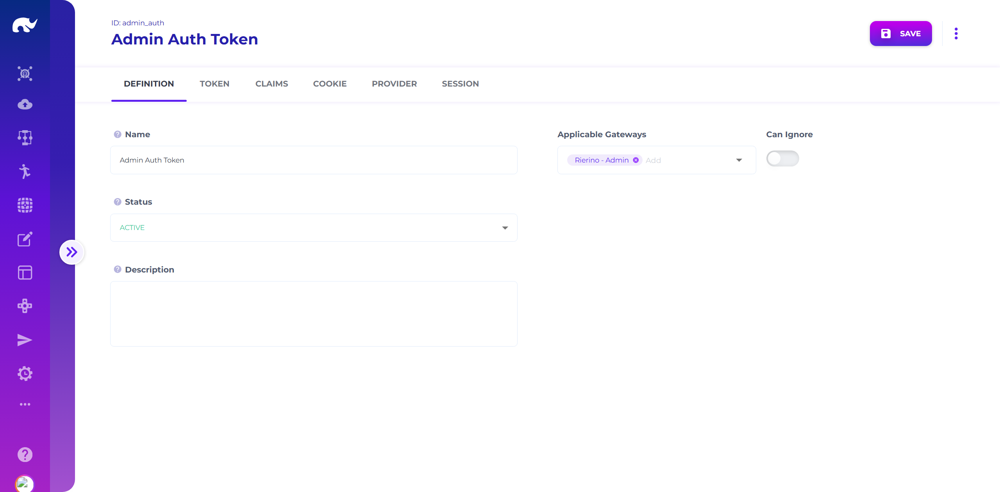

# Gateway Tokens

<figure><figcaption>
Gateway Token UI
</figcaption></figure>

Tokens have the following main settings:

### Definition

* **Name:** Name of the token which will be used in authentication headers.
* **Status:** Whether the token is currently in use or not.
* **Description:** Descriptive information about the token.
* **Applicable Gateways:** List of gateway ids which are allowed to use this token.
* **Can Ignore:** Whether token can be ignored if missing / invalid.

### Token

* **Token Name:** Identifier that will be used in headers & cookies with token value
* **API Key Name:** Name of the [api key](#user-content-fn-1)[^1] which will be used in authentication headers (as an alternative to token, typically for secure server to server authentication)
* **Expiration:** Seconds to expire a token.
* **Grace Period:** Seconds to allow tokens to refresh automatically using refresh\_token received.
* **Long Expiration:** Seconds to expire a refresh token in case "remember me" is selected.
* **For Signed Tokens (JWS):**
  * **Signing Secret:** Secret to use for signing JWS tokens. Length depends on the signing algorithm selected. If empty, tokens are not signed.
  * **Signing Algorithm:** JWS algorithm to use for signing tokens. See [JWSAlgorithm](https://www.javadoc.io/doc/com.nimbusds/nimbus-jose-jwt/latest/com/nimbusds/jose/JWSAlgorithm.html) for supported list. Defaults to HS512.
* For Encrypted Tokens (JWE):
  * **Encryption Secret:** Secret to use for encrypting JWE tokens. Length depends on the encryption algorithm selected. If empty, tokens are not encrypted.
  * **Encryption Key Algorithm:** Algorithm for processing encryption keys. Should be compatible with encryption algorithm. Defaults to AES.
  * **Encryption Algorithm:** JWE algorithm to use for encrypting tokens. See [JWEAlgorithm](https://www.javadoc.io/doc/com.nimbusds/nimbus-jose-jwt/latest/com/nimbusds/jose/JWEAlgorithm.html) for supported list. Defaults to A256KW.
  * **Encryption Method:** Method to use for encrypting tokens. See [EncryptionMethod](https://www.javadoc.io/doc/com.nimbusds/nimbus-jose-jwt/latest/com/nimbusds/jose/EncryptionMethod.html) for supported list. Defaults to A256GCM.
* **Verifiable:** Whether token should carry authentication server tokens for extra verification.
* **Issuer:** Issuer to include in produced tokens.
* **Audience:** List of audience to include in produced tokens.


API keys can be safely generated and resolved using [SecretEventHandler](/broken/pages/blTJECkmngVGRFGp25Ks) hash actions if a third party key management solution is not used.


### Claims

Claims carried by tokens are also configured as a list, with the following parameters:

* **Name:** Name of claim to store in token (e.g. customerId)
* **Class:** Class name for data type of the claim (e.g. java.lang.String)
* **Value:** Constant value to add as the claim
* **Source:** Json path for reading claim from token (if not defined, element is used instead)
* **Element:** Json path for putting claim into event payloads (e.g. customer.id)
* **Special:** Special field for putting claim into event metadata (e.g. ORIGIN\_ID, ORIGIN\_TYPE, SESSION\_ID)
* **Meta Element:** Path for putting claim into request metadata claim fields (e.g. seller), which is also accessible for regular CRUD runner methods (unlike payload elements)
* **Remove:** Whether claim should be removed before returning to the requestor


Claims can be primitive data classes (e.g. string, number) or array of primitive data types. Other data classes (e.g. custom objects) can be translated into JSON strings and parsed in saga flows, or split into primitive claims. &#x20;



Claims can be referenced in variable paths with "@.requestMeta.claims.\[FIELD]" notation.


### Cookie

Cookie settings allow configuration of cookies that are sent to requestors when endpoints are called with cookie=true flag, with the following parameters:

* **Cookie Domain:** Domain to use when token is provided as a cookie.
* **Cookie SameSite:** SameSite configuration when token is provided as a cookie.
* **Cookie Path:** SameSite configuration when token is provided as a cookie. Defaults to /api.
* **Refresh Cookie Path:** Path to use for when refresh token is provided as a cookie. Defaults to /api/auth/refresh.
* **HttpOnly Cookie:** Whether cookie should be set as http only.
* **Secure Cookie:** Whether cookie should be set as secure.

### Provider

Tokens also define backend providers which are used for defining actual authentication servers (such as Keycloak) as well as backend channels for running registration, login activities:

* **Provider Channel:** Gateway channel to use for accessing authentication runner
* **Provider URLs:** Paths to make requests to provider channel for register, login, refresh, etc. actions mapping on to authentication runner sagas

#### Admin UI Login Saga

When designing login saga for the gateway used by Admin UI (/AdminLogin saga in regular deployments), the following parameters can be returned to coordinate different types of login flows:

* **stage:** Defines which stage the current login process is at, with the following values and meanings. If the runner does not send a next "stage" in response, it is expected to send the required tokens or return an error:
  * &#x20;**start:** Means the login started with the user entering credentials, only sent from Admin UI to authentication runner
  * **otp:** Means the the login is processing OTP message sent to user
    * When sent from authentication runner to Admin UI, means the UI will request OTP entry next. Any transaction ID or user identifiers required for OTP validation should be sent with this stage.&#x20;
    * When sent from Admin UI to authentication runner, user entered OTP is sent along with the request for validation&#x20;
  * **otp-repeat:** Means the user requested resending of the OTP message, which is always sent from Admin UI to the runner, which should be responded with "otp" stage
  * **wait:** Means the user is expected to perform an action outside the Admin UI (e.g. external authenticator app)
    * When sent from authentication runner to Admin UI, means the UI will wait for a few seconds to ask for update on the login status from the runner. Any transaction ID or user identifiers required for checking status should be sent with this stage.&#x20;
    * When sent from Admin UI to authentication runner, runner is expected to check for the status and either return a "wait" status if the response is not received yet, or return a successful/failed login response.
* **skipCaptcha:** Defines whether the Admin UI should skip using reCAPTCHA, if sent in response from the authentication runner to Admin UI. Otherwise, Admin UI requires captcha validation after receiving login error responses.
* **skipToken:** If provided in response from the runner, admin API gateway skips generating the gateway token in final response. Typically used in initial steps for a multi-step login process, as token is valid only after final step.&#x20;

### Session

Tokens also hold session data, which is populated using session settings:

* **Session Channel:** Gateway channel to use for accessing session runner
* **Session URLs:** URL paths on session channel to execute session actions
* **Buffer Size:** Number of session update notifications to buffer before sending to server
* **Buffer Ms:** Milliseconds to wait before sending update notifications to server
* **Batch Size:** Number of records to batch for sending update notifications to server


Json Web Token Page


[^1]: Resolved and cached using resolve key endpoint on authentication channel
