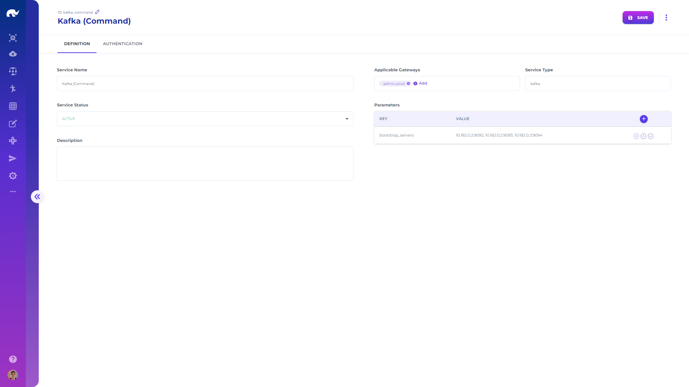

# Gateway Services

All services share the following settings:

* Type: Type of the service ("kafka" or "fs").
* Gateways: List of gateways which are allowed to communicate with this service.

Services also use authentication parameters same as gateway channels, with tokens and access rights defined by path.

Additional parameters applicable for different service types are as follows:

## Kafka

Kafka service is used as a producer, where all Kafka producer settings can be used in parameters.


Kafka Page


## File System

File system service is used for accessing different file systems using Hadoop libraries, and all Hadoop configurations can be used in parameters.

In addition, Rierino provides 3 customized file system implementations:

### FtpFileSystem

This[^1] (com.rierino.util.fs.FtpFileSystem) is a customization of FTPFileSystem, supporting same fs parameters (e.g. fs.ftp.host, fs.ftp.host.port) with minor improvement on original HDFS FTP file system, caching home directory for faster file listing operations.

### CustomS3FileSystem

This[^2] (com.rierino.util.fs.CustomS3FileSystem) is a customization of S3AFileSystem, supporting same fs parameters (e.g. fs.s3a.access.key). The main difference is, this implementation automatically adds content-type metadata to uploaded files based on file extensions, allowing simpler use with CDN solutions. The system automatically detects json, pdf, xml, zip, gif, jpg, png, csv, html and txt extensions. It is also possible to override this detection providing fs.s3a.contentTypes parameter with \[ext]:\[type];\[ext]:\[type];... key-value pairs.

### RestFileSystem

This[^2] (com.rierino.util.fs.RestFileSystem) is a file system which uses rest API endpoints for file operations, calling different url paths for actions such as mkdir, rename, upload. Main use case for this file system is integration with CDN solution which do not support other means (e.g. sftp) for uploading files. URL actions that can be configured include:

* rename.file
* rename.folder
* delete.file
* delete.folder
* mkdir.folder
* upload.folder
* status.file
* status.folder
* status.sub.folder

Each of these actions can be configured with the following parameter settings:

<table><thead><tr><th width="284">Parameter</th><th width="179">Definition</th><th>Example</th><th>Default</th></tr></thead><tbody><tr><td>rest.[action].path</td><td>URL path</td><td>http://example.com/rename</td><td>-</td></tr><tr><td>rest.[action].method</td><td>URL method</td><td>POST</td><td>-</td></tr><tr><td>rest.[action].content</td><td>Content type</td><td>none</td><td>application/json</td></tr><tr><td>rest.[action].request.pattern</td><td>JMESpath pattern for request body</td><td>{"data": @}</td><td>-</td></tr><tr><td>rest.[action].response.pattern</td><td>JMESpath pattern for response body</td><td>@.content</td><td>-</td></tr><tr><td>rest.[action].approach</td><td>Upload approach (file, data)</td><td>data</td><td>file</td></tr><tr><td>rest.[action].clientPrefix</td><td>Prefix to add for rest client configurations</td><td>resteasy.</td><td>-</td></tr><tr><td>rest.header.*, rest.[action].header.*</td><td>Headers to add for all &#x26; action calls</td><td>Authorization=...</td><td>-</td></tr><tr><td>rest.client.*, rest.[action].client.*</td><td>Client properties to add for all &#x26; action calls</td><td>-</td><td>-</td></tr><tr><td>rest.config.*, rest.[action].config.*</td><td>System configurations to use with <a href="../../microservices/elements/systems/#rest">rest system</a></td><td>trust=true</td><td>-</td></tr></tbody></table>


All of these custom file systems can be configured in fs definitions using fs.\[schema].impl parameter (e.g. fs.s3a.impl = com.rierino.util.fs.CustomS3FileSystem).

If the same system has multiple file services configured for the same schema (e.g. one system mapping s3a to S3AFileSystem, another mapping to CustomS3FileSystem), fs.\[schema].impl.disable.cache parameter should be used (e.g. fs.s3a.impl.disable.cache=true), as otherwise all services will use the first cached system class.



Hadoop Page


[^1]: Since v0.5.1

[^2]: Since v0.4.2
