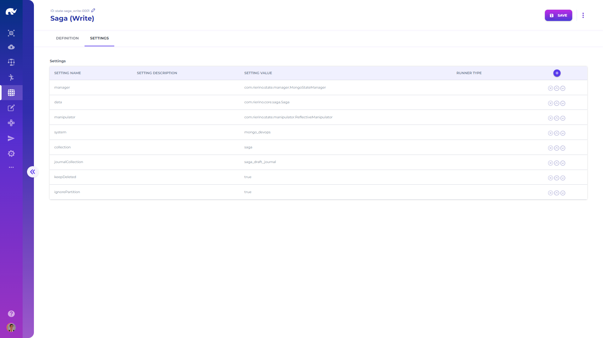

# Elements

Elements describe the functionality, system and database configurations required to build services responding to different types of requests across the platform.

Through combinations of these elements, it is possible to create any microservice without writing single line of code.

There are 10 types of elements, which can be defined using the Rierino admin user interface:

**1.** [**Global Setting**](global-settings.md)**:** Used for describing global settings, which are typically specific to a runner, such as Samza serialization settings (typical settings are already available in standard installations)

**2.** [**Generic Setting**](generic-settings.md)**:** Used for describing settings for a specific prefix, such as "master" system configurations (optional way of configuring systems)

**3.** [**System**](systems/)**:** Used for settings which are applicable to all components of a system, such as the URI for a database connection or URL & authentication details for a 3rd party REST system

**4.** [**Stream**](streams/)**:** Used for describing settings for a data stream, such as a Kafka topic or REST path&#x20;

**5.** [**State Manager**](state-managers/)**:** Used for describing settings for a data store, such as a MongoDB collection or SQL table&#x20;

**6.** [**Listener**](listeners.md)**:** Used for describing settings of a state listener, which responds to updates on a data store (optional, as CDC mechanism provides more flexible capabilities)

**7.** [**Query Manager**](query-managers/)**:** Used for describing settings for a querying a system, such as Elasticsearch or MongoDB&#x20;

**8.** [**Handler**](handlers/)**:** Used for describing a code or package, which is capable of performing procedures and returning results for requests received&#x20;

**9.** [**Action**](actions.md)**:** Used for describing preconfigured function calls on specific handlers with predefined parameter values&#x20;

**10.** [**Role**](roles.md)**:** Used for describing types of roles some data received from a stream can assume

## Element UI

Opening the **Element** screen from **Devops** app menu or navigation bar, you will come across an editor, allowing definition of elements.

### **Definition**

Definition tab is used for defining basic properties of elements, such as name, description and id.

### **Settings**

Settings page is used to populate element type specific properties of each element. Applicable settings for each element type are listed on related element page.
