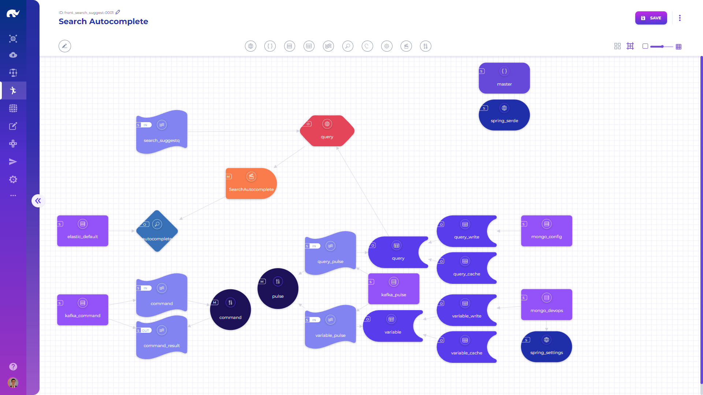

# Runners

A typical runner listens from various streams, uses action and handlers to respond to received data and sends its response to other streams.

A runner is built with a no-code approach, by adding elements through the Devops app.&#x20;

To simplify reuse of elements shared across multiple runners, it is possible to define a set of base runners, which others can extend from. If a runner extends another runner, all of its elements, input/output streams and settings are copied into the new runner during execution. If the new runner includes an element with the same alias, it extends & overrides base runner's element parameters.
