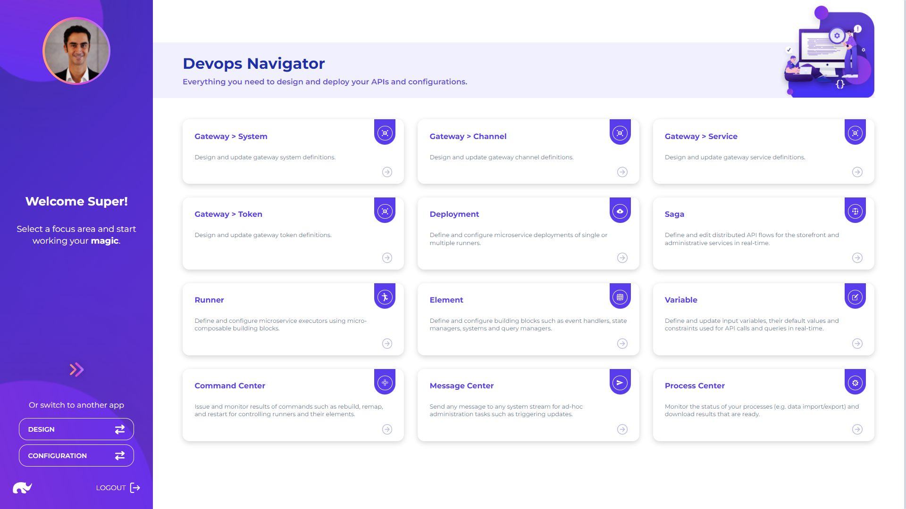

# Overview

DevOps app provides access to key features for designing, deploying and controlling all service building blocks.

These capabilities can be grouped under 4 main categories:

* **API Flows:** Sagas used for implementing [API flows](api-flows/)
* **Microservices:** Elements, runners and deployments for building and using [microservices](microservices/)
* **Gateway & Security:** Key capabilities for configuring [API gateways](gateway-and-security/)
* **Administration:** Key capabilities for controlling deployed services

Relations between the main building blocks managed through this application are as follows:

<figure><figcaption>
Relations between Blocks
</figcaption></figure>

* Gateway configurations allow mapping of API channels (i.e. URL paths) to backend microservices.
* Backend microservices are packaged and installed as deployments, which include one or more runners, each of which include a set of elements that define their capabilities and access rights (e.g. functions that can be executed, systems that can be accessed).
* Microservices are orchestrated through sagas, which are composed of a number of steps, making calls to specific elements on their respective runners.
* Finally, additional information that is required for executing saga steps (such as query or ML model definitions) are kept in state managers, as configurations.&#x20;
