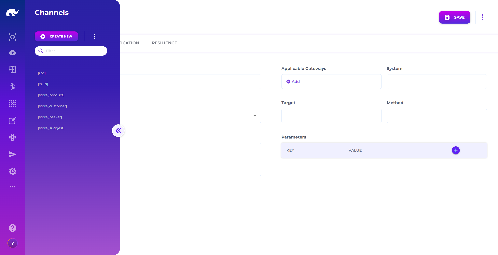

# To-do List Gateway

This exercise exposes the to-do runner outside the cluster. You will create a **Gateway Channel** that forwards requests to the CRUD runner service.

### Before you start

* You completed [To-do List Runner](to-do-list-runner.md) and the runner is deployed.
* You can access the [Devops](https://app.gitbook.com/s/cnDk3J1AzTgg2NFrGPlh/devops) app.
* You know your API base URL: `https://[YOUR_ADMIN_API_DOMAIN]`.
* You have a gateway instance to target (example: `admin-prod`).


This guide configures the endpoint as **public** for simplicity. For real environments, require auth and limit paths.


### What you’ll build

* **Gateway Channel ID**: `todo_crud`
* **Public request path**: `GET /api/request/todo_crud/todo`
* **Target runner base URL** (example, internal):\
  `http://runner-spring-example-0001-service.admin-backend.svc.cluster.local:1235`
* **Runner target prefix**: `/api/todo`



### Open the Gateway Channel screen

Open the [Gateway Channels](../../devops/api-gateway-and-security/gateway-servers/gateway-channels.md) screen from the Devops app.

Unless you changed routing, the UI is at `https://[YOUR_ADMIN_UI_DOMAIN]/app/devops/common/gateway_channel`.

<figure><figcaption><p>Gateway Channel Screen</p></figcaption></figure>



### Create a new channel (todo\_crud)

Click **CREATE NEW** and assign the channel ID:

* `todo_crud`

Fill in the channel details and save:

<figure><figcaption><p>Gateway Channel Definition Screen</p></figcaption></figure>

* **DEFINITION**
  * **Channel Name:** `Todo`
  * **Channel Status:** `ACTIVE`
  * **Description:** `CRUD path to todo list runner`
  * **Applicable Gateways:** `admin-prod`
  * **System Executor:** `CRUD`
  * **System Parameters**
    * **Key:** `server.baseUrl`
    * **Value:** `http://runner-spring-example-0001-service.admin-backend.svc.cluster.local:1235`
  * **Target:** `/api/todo`
* **AUTHENTICATION**
  * **Path Authentications:** `{ "*": { "isPublic": true } }`

This mapping means:

* The gateway receives requests under the channel name (`todo_crud`).
* It forwards the request to the runner service at `server.baseUrl`.
* It prefixes the forwarded path with `/api/todo`.

So a request to:

* `GET https://[YOUR_ADMIN_API_DOMAIN]/api/request/todo_crud/todo`

is forwarded to:

* `GET http://...:1235/api/todo/todo`



### Wait for reload (or trigger it manually)

Most environments auto-reload gateway config after a short interval.

If you need to force a reload, call:

```
POST https://[YOUR_ADMIN_API_DOMAIN]/api/control/system/example-admin
POST https://[YOUR_ADMIN_API_DOMAIN]/api/control/channel/todo_crud
```


If your gateway is configured differently, your control endpoints or system name may differ. Keep the idea: reload the gateway system, then reload the channel.




### Test the gateway endpoint

List to-do items through the public gateway endpoint:

```
GET https://[YOUR_ADMIN_API_DOMAIN]/api/request/todo_crud/todo
```

Expected result:

* HTTP `200`
* A JSON array containing any records you created earlier

If you get an empty list, create one item first (either via direct runner testing or by sending a `POST` through this same gateway channel).



### Next step

Build an admin screen on top of this endpoint in [To-do List UI](to-do-list-ui.md).

### Troubleshooting

* **404 on `/api/request/todo_crud/...`**: the channel ID is wrong or not active. Confirm it is saved and `ACTIVE`.
* **502/504**: `server.baseUrl` is unreachable from the gateway. Verify the service name, namespace, and port (`1235`).
* **401/403**: authentication is enforced by your gateway policy. Update **Path Authentications** or provide the required token.
* **Old behavior after edits**: trigger a manual reload using the control endpoints (or wait for the reload interval).
