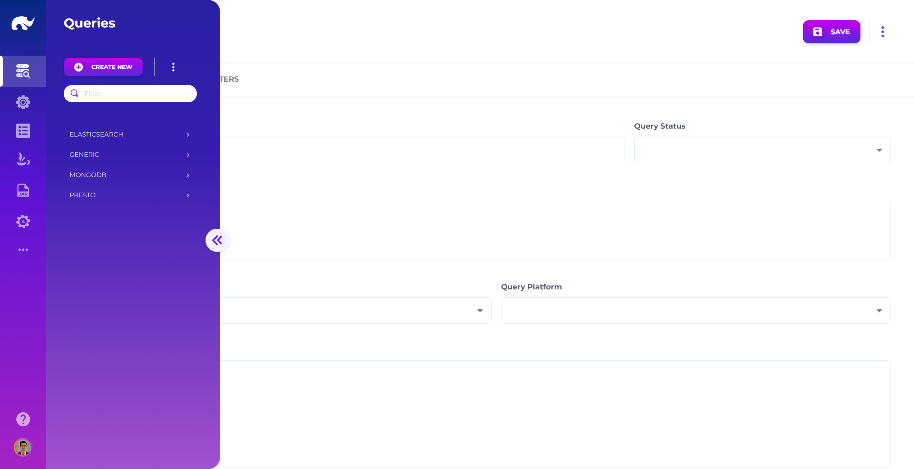
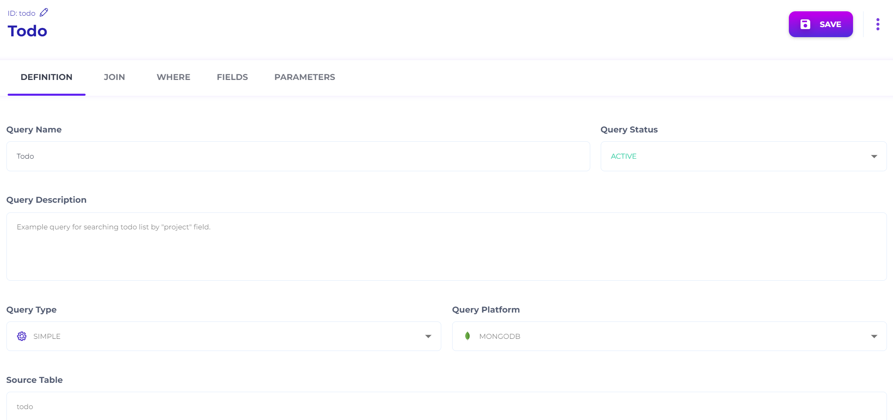
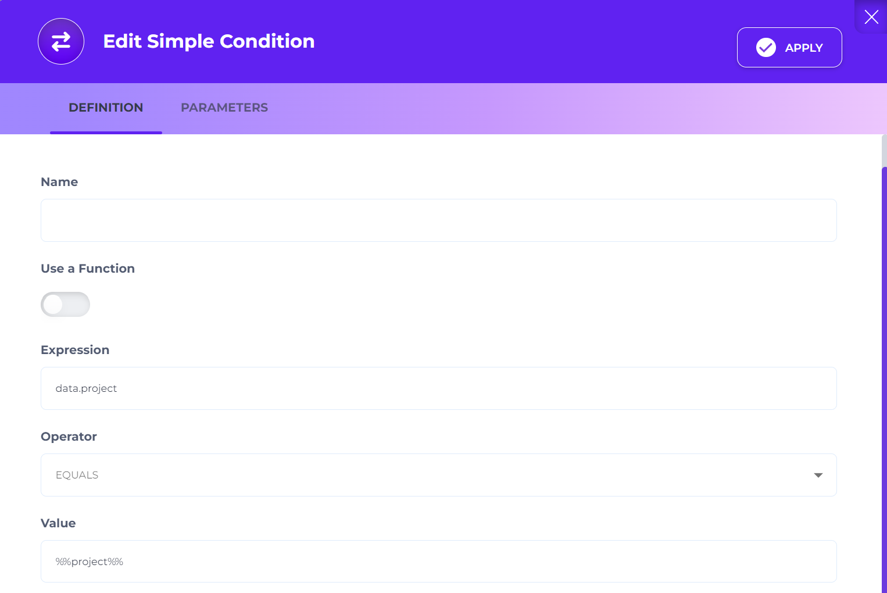
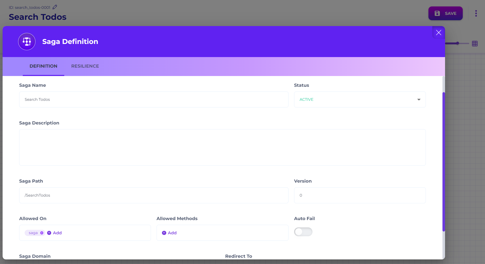
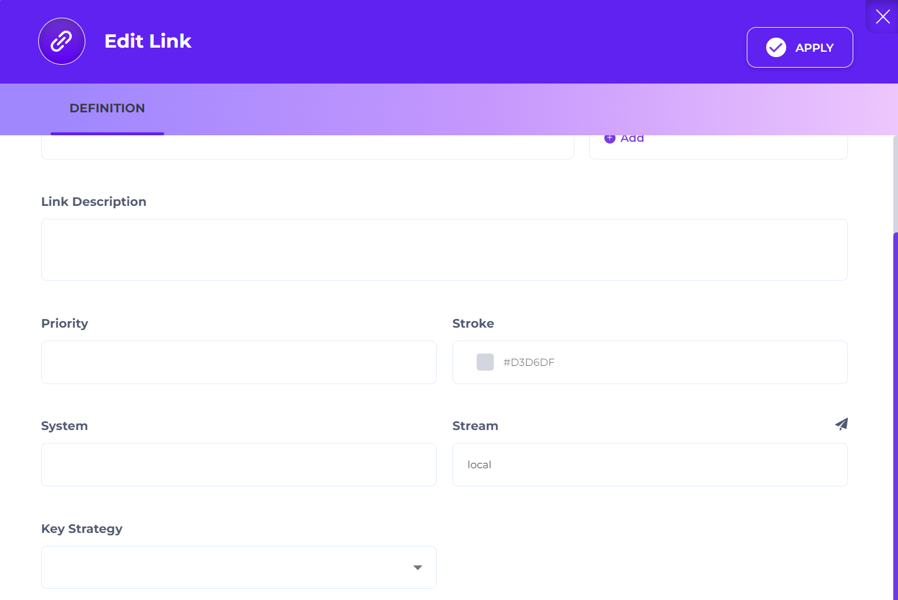
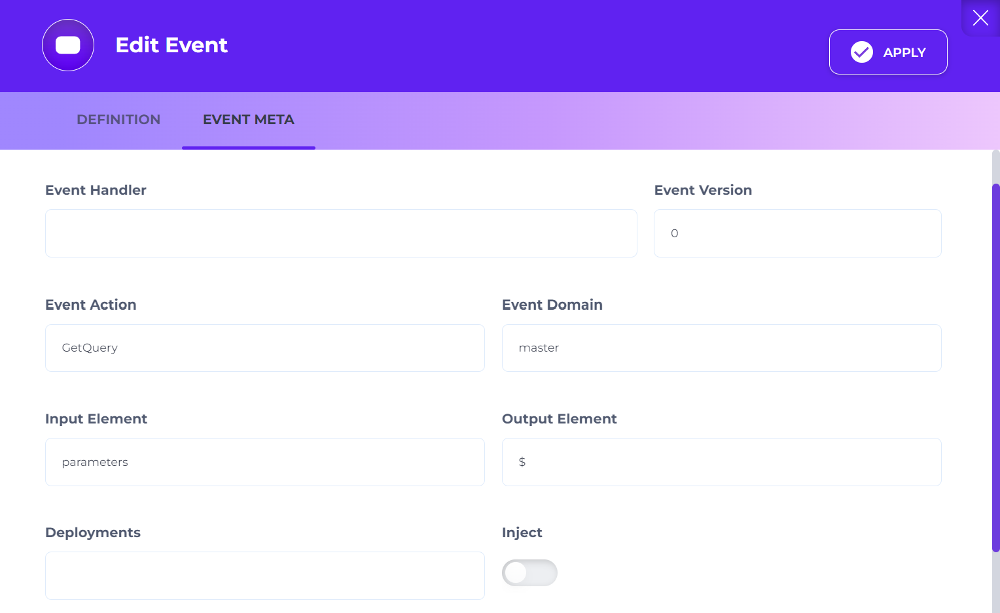
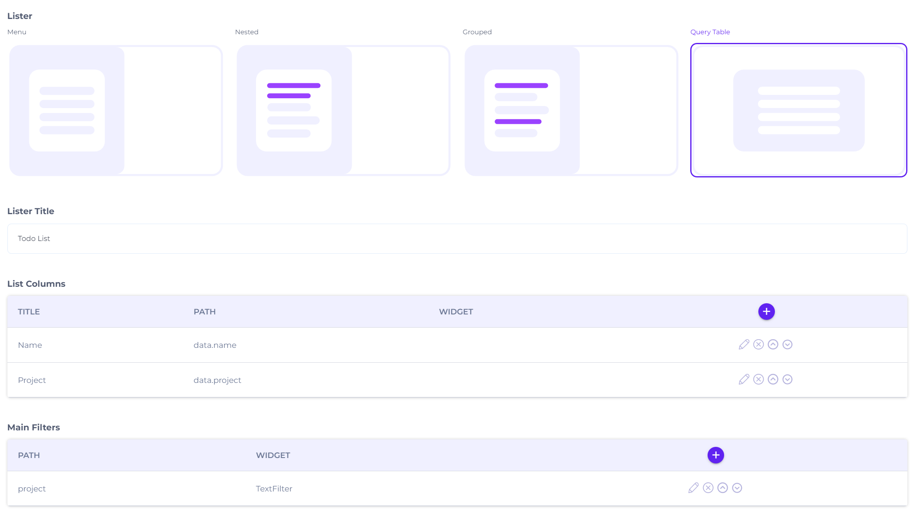
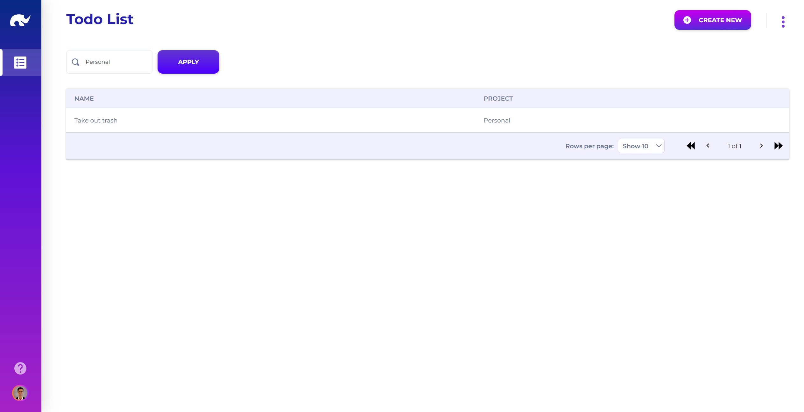

# To-do List Query

This exercise adds a simple search flow on top of the to-do list. You will:

* define a **Query** that filters todos by `data.project`
* expose it as an API using a **Saga**
* update the UI lister to call the query endpoint and show filtered results

### Before you start

* You completed [To-do List UI](to-do-list-ui.md).
* You can access:
  * the [Query](../../configuration/queries/) screen in the Configuration app
  * the [Saga](../../devops/api-event-and-process-flows/) screen in the Devops app
  * the [Source](../../design/api-mapping/) and [UI](../../design/user-interface/uis/) screens in the Design app
* You know your API base URL: `https://[YOUR_ADMIN_API_DOMAIN]`.


Why use a Saga?

The `todo-0001` runner is a **CRUD runner**. CRUD runners are designed for standard read/write operations.

For querying, you typically expose a dedicated RPC endpoint using a Saga (or an RPC runner).


### What you’ll build

* **Query ID**: `todo`
  * Filters `data.project = %%project%%`
* **Saga path**: `/SearchTodos`
* **API endpoint**: `GET https://[YOUR_ADMIN_API_DOMAIN]/api/request/rpc/SearchTodos?project=Personal`
* **Source update**: add `query -> request/rpc/SearchTodos`
* **UI update**: switch lister to **Query Table** and add a `project` filter



### Open the Query screen

Open the [Query](../../configuration/queries/) screen from the [Configuration](/broken/spaces/cnDk3J1AzTgg2NFrGPlh/pages/NhIhtgvnmxDul9vF2Bww) app.

Unless you changed routing, the UI is at `https://[YOUR_ADMIN_UI_DOMAIN]/app/configuration/common/query`.

<figure><figcaption><p>Query Screen</p></figcaption></figure>



### Create the Query (todo)

Click **CREATE NEW** and set the Query ID:

* `todo`

Fill in the **DEFINITION** tab:

<figure><figcaption><p>Query Definition Screen</p></figcaption></figure>

* **Query Name:** `Todo`
* **Query Status:** `ACTIVE`
* **Query Description (optional):** `Search todo list by project.`
* **Query Type:** `SIMPLE`
* **Query Platform:** `MONGODB`
* **Source Table:** `todo`



### Add a WHERE condition (project)

Open the **WHERE** tab.

Hover on the plus icon and select **Simple**.

Edit the new condition:

<figure><figcaption><p>Query Condition Dialog</p></figcaption></figure>

* **Use a Function:** `false`
* **Expression:** `data.project`
* **Operator:** `EQUALS`
* **Value:** `%%project%%`

Save the query.


`%%project%%` is a parameter placeholder. You’ll pass it at runtime through the API call.




### Open the Saga screen

Open the [Saga](../../devops/api-event-and-process-flows/) screen from the [Devops](/broken/spaces/cnDk3J1AzTgg2NFrGPlh/pages/PWyjQCLF01E9OngBbsr8) app.

If you need a refresher on the basics, follow the structure in [Exercise: Hello World API](../training-examples/exercise-create-an-api-endpoint.md).



### Create a Saga (SearchTodos)

Create a new saga and set:

<figure><figcaption><p>Search Todos Saga Definition Screen</p></figcaption></figure>

* **Saga Name:** `Search Todos`
* **Status:** `ACTIVE`
* **Saga Path:** `/SearchTodos`
* **Version:** `0`
* **Allowed On:** `saga`
* **Saga Domain:** `util`



### Add steps (Start → Event → Success)

Add **Start**, **Event**, and **Success** steps from the stencil.

Link them to form:

* `Start` → `Event` → `Success`



### Configure the Start → Event link (local execution)

Edit the link from **Start** to **Event**:

<figure><figcaption><p>Saga Link Definition Dialog</p></figcaption></figure>

* **Stream:** `local`

`local` means the gateway executes the step without delegating to a remote runner.



### Configure the Event step (GetQuery)

Edit the **Event** step:

<figure><figcaption><p>Saga Event Definition Dialog</p></figcaption></figure>

* **DEFINITION**
  * **Step Name:** `Get Project Todos`
* **EVENT META**
  * **Event Version:** `0`
  * **Event Action:** `GetQuery`
  * **Event Domain:** `master`
  * **Input Element:** `parameters`
  * **Output Element:** `$`
  * **Parameters Map**
    * **Key:** `queryId`
    * **Value:** `todo`

This step executes [GetQuery](/broken/spaces/cnDk3J1AzTgg2NFrGPlh/pages/oAal4A8dPg9i6GOLrJcV) against the `master` system, using the Query ID `todo`.

It reads query parameters from `parameters` (so `project=...` becomes available as `%%project%%`).



### Save the Saga

Click **SAVE** to activate the saga. Wait for the gateway/runner reload interval if your environment uses one.



### Test the API endpoint

Call:

```
GET https://[YOUR_ADMIN_API_DOMAIN]/api/request/rpc/SearchTodos?project=Personal
```

Expected result:

* HTTP `200`
* A list of todos where `data.project` equals `Personal`



### Update the Source (add the query URL)

Open the `todo` Source in the Design app (`.../app/design/common/source?id=todo`).

Add a new URL row:

* **Action:** `query`
* **URL:** `request/rpc/SearchTodos`

Save the Source.



### Update the UI lister (use Query Table + filter)

Open the `todo` UI in the Design app (`.../app/design/common/ui?id=todo`).

Update the **LISTER** tab:

<figure><figcaption><p>UI Lister Screen</p></figcaption></figure>

* **Lister:** `Query Table`
* **List Columns**
  * **Title:** `Name`, **Path:** `data.name`
  * **Title:** `Project`, **Path:** `data.project`
* **Main Filters**
  * **Path:** `project`, **Widget:** `TextFilter`, **Properties:** `{ "label": "Project" }`

Save the UI.



### Verify in the app

Open your Example app and go to the Todo screen.

You should now see a filter input for **Project**. Searching should call the saga endpoint and return filtered results.

<figure><figcaption><p>Updated Todo Screen</p></figcaption></figure>



### Next step

You now have a complete end-to-end example: CRUD + gateway + UI + query + saga.

If you want to expand it, add:

* multiple filters (name contains, status, date range)
* pagination/sorting in the query lister
* authentication on the gateway channel

### Troubleshooting

* **Empty results**: ensure you have at least one todo with `data.project = "Personal"`.
* **Saga returns an error about `queryId`**: confirm the Query ID is exactly `todo`.
* **Parameter not applied**: confirm the saga reads from **Input Element: `parameters`** and you call `?project=...`.
* **UI still does CRUD calls**: confirm you added the Source URL for action `query` and changed the lister to **Query Table**.
