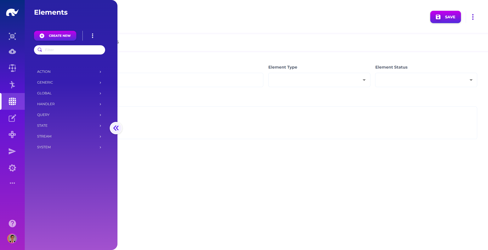
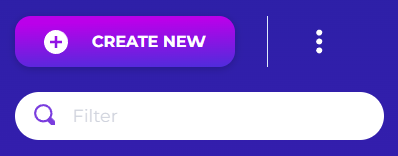
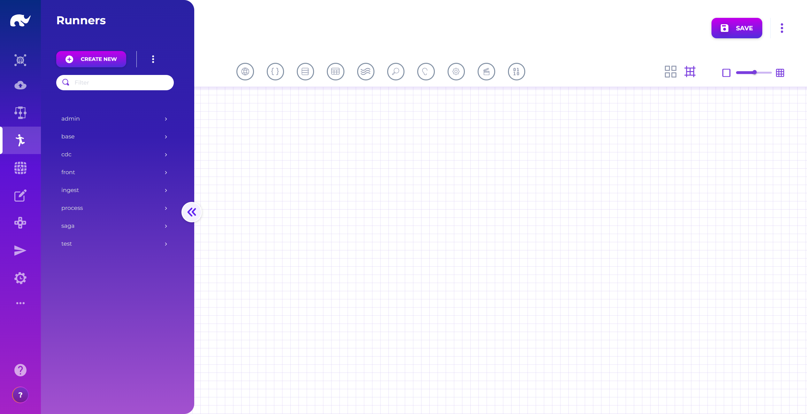
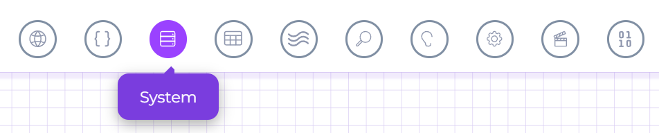
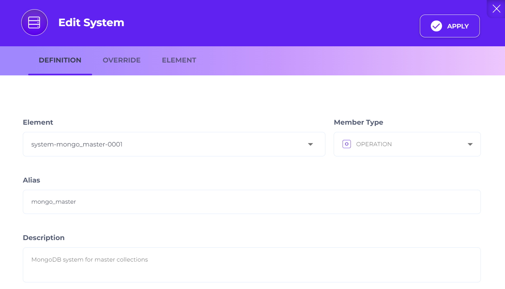
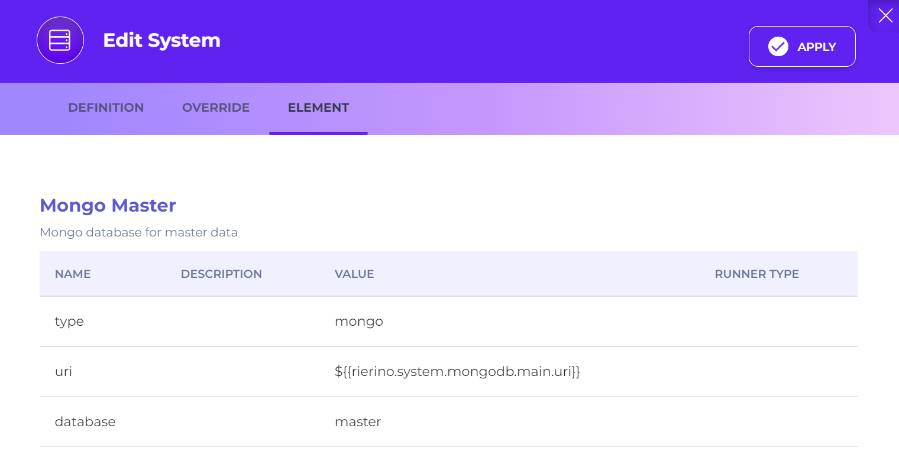
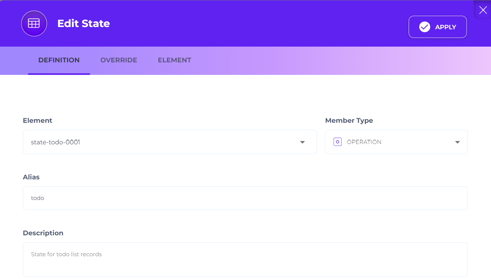
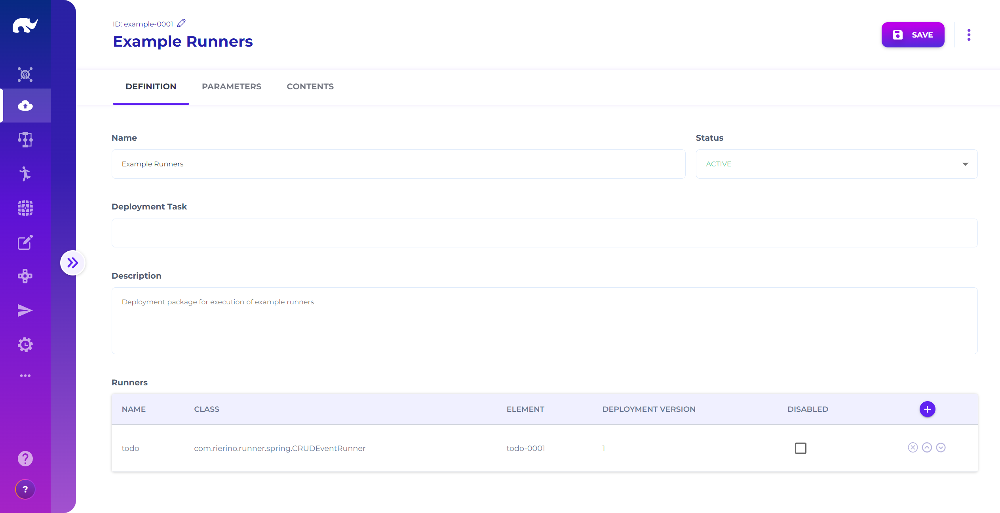
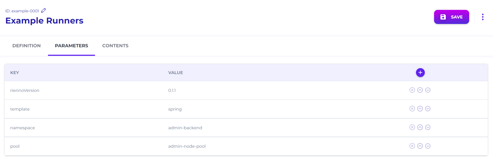
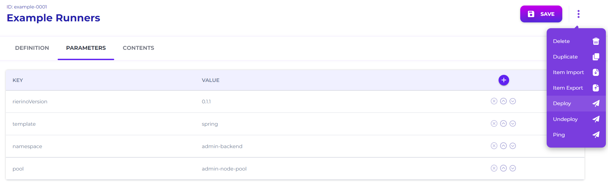

# To-do List Runner

This exercise creates the backend microservice for the to-do list. You will define the MongoDB-backed state, wire it into a CRUD runner, deploy it, and confirm it responds to basic read/write calls.

### Before you start

* You can access the [Devops](/broken/spaces/cnDk3J1AzTgg2NFrGPlh/pages/PWyjQCLF01E9OngBbsr8) app.
* The platform has a MongoDB system Element available (typically `system-mongo_master-0001`).
* You know your Admin UI base URL: `https://[YOUR_ADMIN_UI_DOMAIN]`.


If you are on a **Sandbox** deployment, UI-based deployments may be disabled. You can still complete the design steps. For runtime, you may need to add the runner to an existing deployment and restart the container(s).


### What you’ll build

* **State Element**: `state-todo-0001` backed by MongoDB collection `todo`
* **Runner**: `todo-0001` based on **Base CRUD**
* **Deployment (K8s example)**: `example-0001`
* **Runner endpoints (internal)**: `/api/todo/todo`



### Open the Elements screen

Open the [Elements](../../devops/microservices/building-blocks/) screen from the Devops app.

Unless you changed routing, the UI is at `https://[YOUR_ADMIN_UI_DOMAIN]/app/devops/common/element`.

<figure><figcaption><p>Element Screen</p></figcaption></figure>



### Create a State Element (MongoDB collection)

Click **CREATE NEW** to start a blank Element.

<figure><figcaption><p>Create New Button</p></figcaption></figure>

Assign the Element ID from the top-left **ID:** field:

* `state-todo-0001`

<details>

<summary>ID conventions (optional)</summary>

Prefer readable IDs for exercises and examples. It makes logs, tracing, and migrations easier to follow.


Stick to alphanumerics plus `-` and `_`. Use a numeric suffix (like `-0001`) when you expect multiple copies.


</details>

Fill in the **DEFINITION** and **STATE DEFINITION** tabs and save:

<figure><figcaption><p>State Definition Tab</p></figcaption></figure>

* **DEFINITION**
  * **Element Name:** `Todo`
  * **Element Type:** `STATE`
  * **Element Status:** `ACTIVE`
  * **Element Description (optional):** `Example todo list data store`
* **STATE DEFINITION**
  * **Manager:** `Mongo State Manager`
  * **System:** `mongo_master`
  * **Collection:** `todo`

This creates a state backed by [MongoDB Collection](../../devops/microservices/building-blocks/data-sources/shared-states/mongodb-collection.md). It reuses the existing `mongo_master` system configuration.


**Why define a State as an Element?**

Elements are reusable building blocks. They keep runners small and composable.

When you centralize state and system config as Elements, you avoid duplicating connection details across many runners.




### Open the Runner screen

Open the [Runners](../../devops/microservices/service-runners/) screen from the Devops app.

Unless you changed routing, the UI is at `https://[YOUR_ADMIN_UI_DOMAIN]/app/devops/common/runner`.

<figure><figcaption><p>Runner Screen</p></figcaption></figure>



### Create a CRUD runner

Click **CREATE NEW** and set the Runner ID:

* `todo-0001`

Click the **Definition** icon (circled edit icon) to open runner metadata.

<figure><figcaption><p>Definition Button</p></figcaption></figure>

Fill in:

<figure><figcaption><p>Runner Definition Screen</p></figcaption></figure>

* **Runner Name:** `Todo`
* **Runner Status:** `ACTIVE`
* **Runner Domain (optional):** `admin`
* **Base Runners:** `Base CRUD`
* **Runner Description (optional):** `CRUD runner for todo list management.`

Close the dialog to apply changes.


Using **Base CRUD** gives you standard read/write behavior. You only need to plug in a State.




### Add Elements to the runner graph (System + State)

Drag a **System** element and a **State** element from the stencil.

<figure><figcaption><p>Runner Stencil</p></figcaption></figure>

Your graph should look like this:

<figure><figcaption><p>Runner Elements</p></figcaption></figure>



### Configure the System member (mongo\_master)

Select the **System** node. Click the pencil icon.

<figure><figcaption><p>System Selection Screen</p></figcaption></figure>

Set:

* **Element:** `system-mongo_master-0001`
* **Member Type:** `OPERATION`
* **Alias:** `mongo_master`
* **Description (optional):** `MongoDB system for master collections`

Click **APPLY**.


**Why use aliases?**

Aliases let you swap the underlying Element later without rewriting every reference. They also let you reuse the same Element multiple times with different overrides.


Optional: open the **ELEMENT** tab to review the system parameters.

<figure><figcaption><p>System Element Screen</p></figcaption></figure>



### Configure the State member (todo)

Select the **State** node. Click the pencil icon.

<figure><figcaption><p>State Selection Screen</p></figcaption></figure>

Set:

* **Element:** `state-todo-0001`
* **Member Type:** `OPERATION`
* **Alias:** `todo`
* **Description (optional):** `State for todo list records`

Click **APPLY**.

At this point, the runner has everything it needs to execute CRUD operations. Save the runner.



### Create a Deployment (K8s environments)

Open the [Deployments](../../devops/microservices/deployment-packages/) screen from the Devops app.

Unless you changed routing, the UI is at `https://[YOUR_ADMIN_UI_DOMAIN]/app/devops/common/deployment`.

Click **CREATE NEW** and set the Deployment ID:

* `example-0001`

Fill in **DEFINITION**:

<figure><figcaption><p>Deployment Definition Screen</p></figcaption></figure>

* **Name:** `Example Runners`
* **Status:** `ACTIVE`
* **Description (optional):** `Deployment package for execution of example runners`
* **Runners**
  * **Name:** `todo`
  * **Class:** `CRUD Runner`
  * **Element:** `todo-0001`
  * **Deployment Version:** `1`


**Why deploy separately from the runner definition?**

Runners define behavior. Deployments define where and how it runs (namespace, replicas, versioning).


Switch to **PARAMETERS** and set (adjust to your environment):

<figure><figcaption><p>Deployment Parameters Screen</p></figcaption></figure>

* **rierinoVersion:** `ENTER YOUR VERSION`
* **template:** `spring`
* **namespace:** `admin-backend`
* **pool:** `admin-node-pool`

Click **SAVE**.


For scale, set `replicaCount` to `2+`. For deeper logs, set `logLevel` to `DEBUG`.




### Trigger the deployment

From the top-right deployment menu, click **DEPLOY**.

<figure><figcaption><p>Deployment Action Menu</p></figcaption></figure>

Wait for your pipeline to finish. You should also see a UI notification that the request was sent.



### Test the runner (without gateway)

In most K8s setups, runners are not publicly exposed. They are reachable from inside the cluster or through [Gateway Servers](../../devops/api-gateway-and-security/gateway-servers/).

If you want to test immediately, exec into the runner pod:

```shell
kubectl exec -ti --namespace=admin-backend deployment/runner-example-0001-deployment -- /bin/bash
```

Then call the local endpoints:

```shell
# should return status:"UP"
curl localhost:1235/actuator/health

# should return the newly created record
curl -X POST -H "Content-Type: application/json" \
  -d '{"data": {"name": "Take out trash", "project": "Personal"}}' \
  localhost:1235/api/todo/todo/1

# should return a list including the new record
curl localhost:1235/api/todo/todo
```

Once these work, you are ready to expose the service through the gateway.



### Next step

Expose the runner over an external API path in [To-do List Gateway](to-do-list-gateway.md).

### Troubleshooting

* **Can’t find `system-mongo_master-0001`**: confirm your installation includes the default Mongo system element. If not, create a Mongo System Element first.
* **State writes fail**: confirm `mongo_master` points to a reachable MongoDB and that the user has write access.
* **`/actuator/health` not reachable**: the deployment may still be starting. Check pod status and logs.
* **UI deployment disabled**: you are likely on Sandbox. Apply the runner to an existing deployment and restart the container(s).
