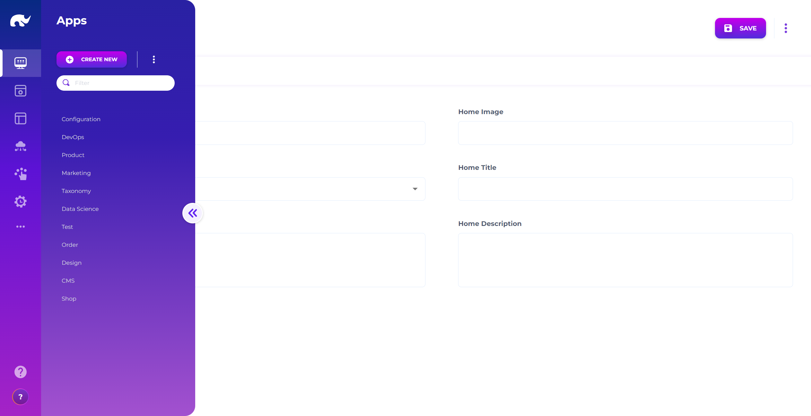
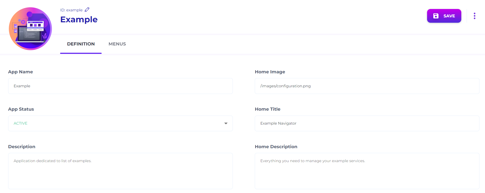
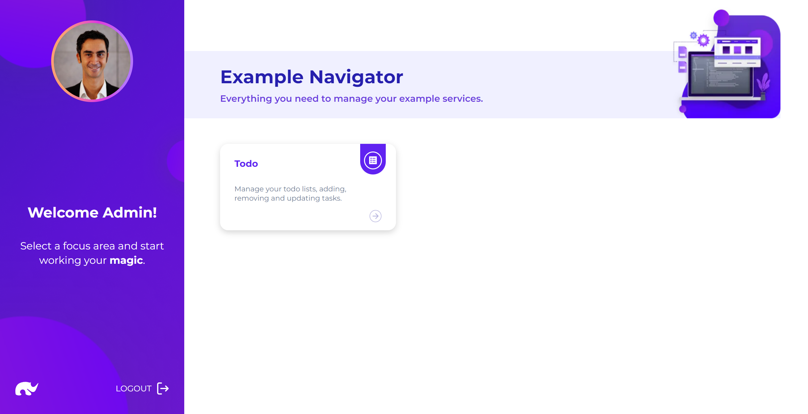
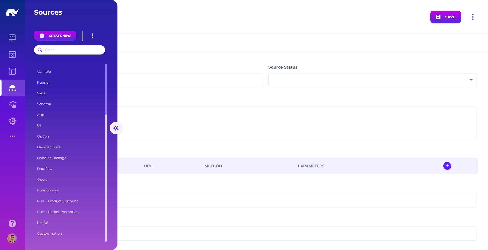
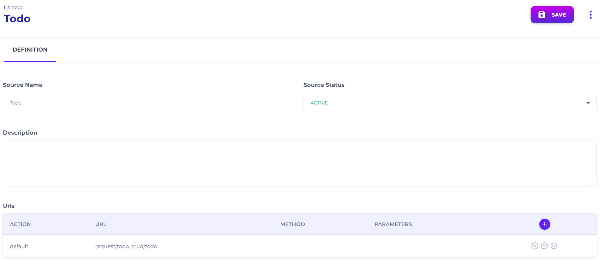
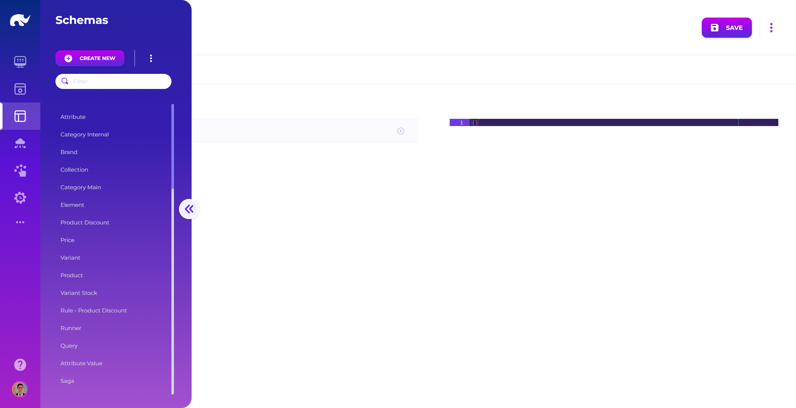
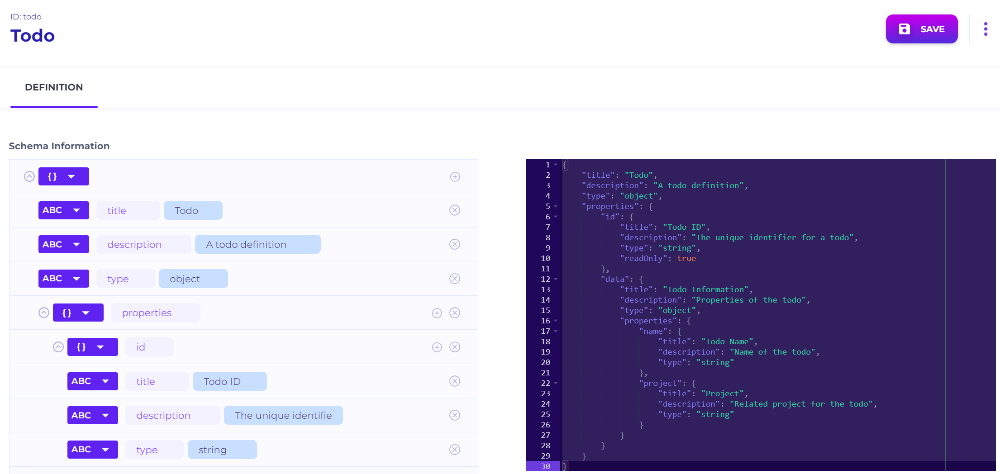
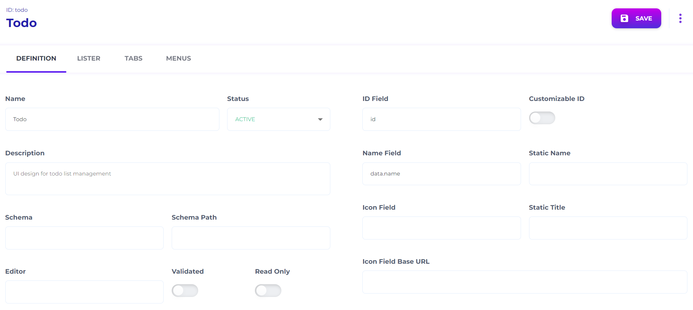
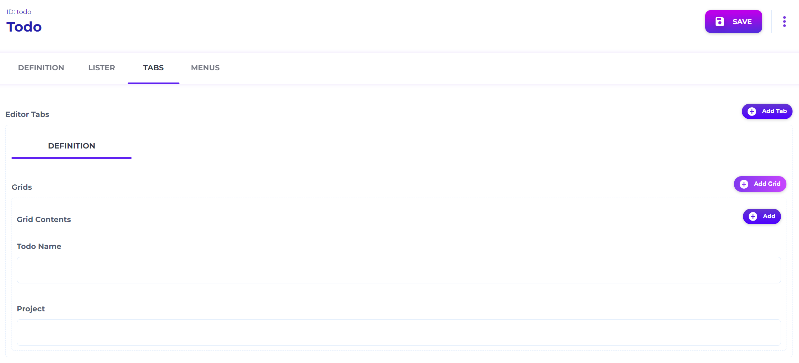
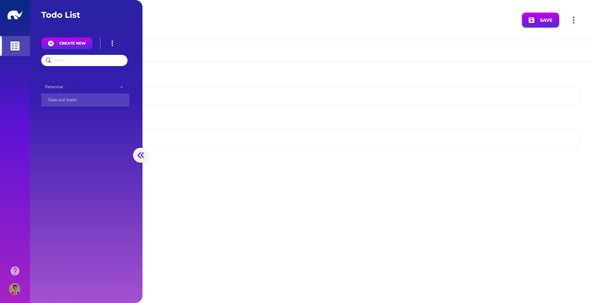

# To-do List UI

This exercise builds the Admin UI on top of your to-do API. You will create an App entry, map the UI to the gateway endpoint with a Source, define a JSON Schema, and build a basic CRUD screen.

### Before you start

* You completed [To-do List Gateway](to-do-list-gateway.md).
* The gateway endpoint works: `GET https://[YOUR_ADMIN_API_DOMAIN]/api/request/todo_crud/todo`.
* You can access the [Design](/broken/spaces/cnDk3J1AzTgg2NFrGPlh/pages/R6CwbBwzD5B7a9dcS18z) app.
* You know your Admin UI base URL: `https://[YOUR_ADMIN_UI_DOMAIN]`.

### What you’ll build

* **App ID**: `example`
  * Menu path: `/common/todo`
* **Source ID**: `todo`
  * Default URL: `request/todo_crud/todo`
* **Schema ID**: `todo` (JSON Schema)
* **UI ID**: `todo`
  * Grouped lister by `data.project`
  * Editor fields: `data.name`, `data.project`



### Open the App screen

Open the [Apps](../../design/user-interface/apps.md) screen from the Design app.

Unless you changed routing, the UI is at `https://[YOUR_ADMIN_UI_DOMAIN]/app/design/common/app`.

<figure><figcaption><p>App Screen</p></figcaption></figure>



### Create an App (example)

Click **CREATE NEW** and set the App ID:

* `example`

Fill in:

<figure><figcaption><p>App Definition Screen</p></figcaption></figure>

* **DEFINITION**
  * **App Name:** `Example`
  * **App Status:** `ACTIVE`
  * **Description (optional):** `Application dedicated to list of examples.`
  * **Home Image:** `/image/configuration.png`
  * **Home Title:** `Example Navigator`
  * **Home Description:** `Everything you need to manage your example services.`
* **MENUS**
  * **Label:** `Todo`
  * **Icon:** `rules`
  * **Path:** `/common/todo`

Save the App.

Open `https://[YOUR_ADMIN_UI_DOMAIN]/app/example` to verify:

<figure><figcaption><p>Example App Home Page</p></figcaption></figure>



### Open the Source screen

Open the [Sources](../../design/api-mapping/) screen from the Design app.

Unless you changed routing, the UI is at `https://[YOUR_ADMIN_UI_DOMAIN]/app/design/common/source`.

<figure><figcaption><p>Source Screen</p></figcaption></figure>



### Create a Source (todo)

Click **CREATE NEW** and set the Source ID:

* `todo`

Set:

<figure><figcaption><p>Source Definition Screen</p></figcaption></figure>

* **Source Name:** `Todo`
* **Source Status:** `ACTIVE`
* **Urls**
  * **Action:** `default`
  * **URL:** `request/todo_crud/todo`

This directs UI CRUD traffic to your gateway channel endpoint:

* `/api/request/todo_crud/todo`


**Why do you need a Source?**

Sources decouple UI screens from physical endpoints. You can move services later without rewriting UIs.

Sources are also a control point. Without a Source, the platform treats CRUD access as disabled for UI.




### Open the Schema screen

Open the [Data Schema](../../design/data-schema/) screen from the Design app.

Unless you changed routing, the UI is at `https://[YOUR_ADMIN_UI_DOMAIN]/app/design/common/schema`.

<figure><figcaption><p>Schema Screen</p></figcaption></figure>



### Create a Schema (todo)

Click **CREATE NEW** and set the Schema ID:

* `todo`

Paste this JSON Schema and save:

<figure><figcaption><p>Schema Definition Screen</p></figcaption></figure>

```json
{
  "title": "Todo",
  "description": "A todo definition",
  "type": "object",
  "properties": {
    "id": {
      "title": "Todo ID",
      "description": "The unique identifier for a todo",
      "type": "string",
      "readOnly": true
    },
    "data": {
      "title": "Todo Information",
      "description": "Properties of the todo",
      "type": "object",
      "properties": {
        "name": {
          "title": "Todo Name",
          "description": "Name of the todo",
          "type": "string"
        },
        "project": {
          "title": "Project",
          "description": "Related project for the todo",
          "type": "string"
        }
      }
    }
  }
}
```

Schema titles and descriptions populate UI labels. They also standardize your data model.


Schema definitions follow JSON Schema. You can reuse them outside Rierino.




### Open the UI screen

Open the [UIs](../../design/user-interface/uis/) screen from the Design app.

Unless you changed routing, the UI is at `https://[YOUR_ADMIN_UI_DOMAIN]/app/design/common/ui`.



### Create a UI (todo)

Click **CREATE NEW** and set the UI ID:

* `todo`

Fill in:

<figure><figcaption><p>UI Definition Screen</p></figcaption></figure>

* **DEFINITION**
  * **Name:** `Todo`
  * **Status:** `ACTIVE`
  * **Description (optional):** `UI design for todo list management`
  * **ID Field:** `id`
  * **Name Field:** `data.name`
* **LISTER**
  * **Lister:** `Grouped`
  * **Lister Title:** `Todo List`
  * **Group By:** `data.project`

Switch to **TABS** and build the editor:

1. Click **Add Tab**.
2. Set the tab label to `DEFINITION`.
3. Click **Add Grid**.
4. Click **Add** and set **Path** to `data.name`. Select **Text**.
5. Click **Add** and set **Path** to `data.project`. Select **Text**.

You should see:

<figure><figcaption><p>UI Tabs Screen</p></figcaption></figure>

Save the UI.


**Why is UI separate from Schema?**

One Schema can power many UIs. This helps with permissions and team-specific views.

It also supports headless usage. Your APIs can work without UI definitions.




### Test the UI

Open your Example app:

* `https://[YOUR_ADMIN_UI_DOMAIN]/app/example`

Click the **Todo** menu entry.

You should be able to list, create, edit, and delete todos. Items should be grouped by `data.project`.

<figure><figcaption><p>Todo Screen</p></figcaption></figure>



### Next step

Add search support with [To-do List Query](to-do-list-query.md).

### Troubleshooting

* **Todo menu does not show up**: confirm the App is `ACTIVE` and the menu path is `/common/todo`.
* **UI opens but list is empty**: create a record via the runner/gateway first, or confirm Mongo is reachable.
* **403/401 from the UI**: your gateway channel requires auth, or your session/token is missing required claims.
* **404 from the UI**: confirm Source URL is `request/todo_crud/todo` and the gateway channel ID is `todo_crud`.
