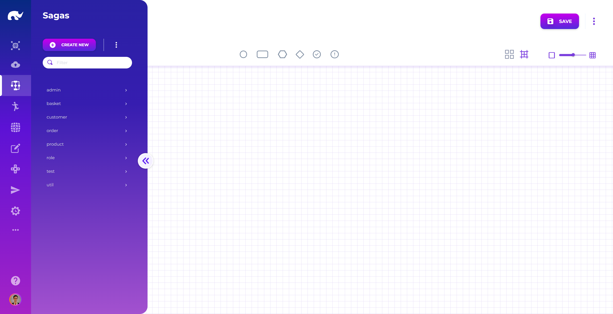
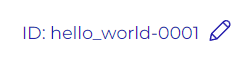
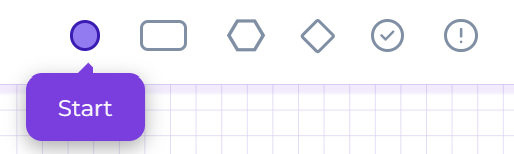
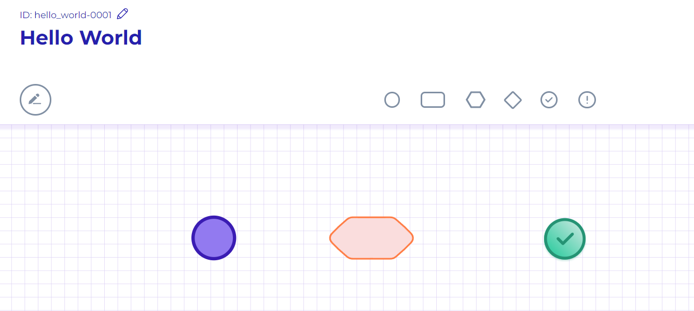
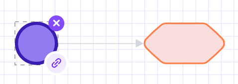
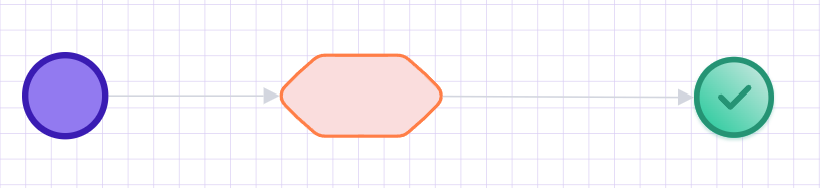
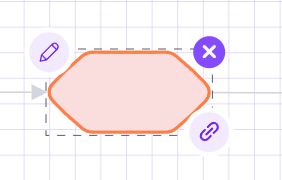
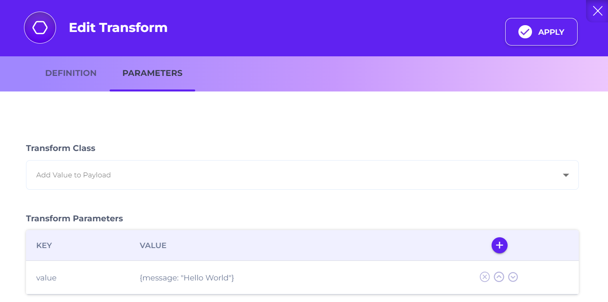
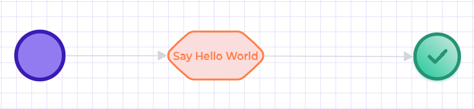

# Exercise: Hello World API

This exercise creates a tiny saga and exposes it as an API endpoint. You will run it through the **Train RPC** runner. The flow uses only three steps: `Start` → `Transform` → `Success`.

### Before you start

* You can access the **Devops** app and the **Saga** screen.
* The training deployment (including `train_rpc`) is installed and running.
* You know your API base URL: `https://[YOUR_ADMIN_API_DOMAIN]`.

### What you’ll build

* **Saga path**: `/HelloWorld`
* **Runner**: `train_rpc` (via **Allowed For: Train RPC**)
* **Response**: HTTP `200` with body `{message: "Hello World"}`



### Open the Saga screen

Open the [Saga](../../../devops/api-flows/) screen from the [Devops](/broken/pages/PWyjQCLF01E9OngBbsr8) app.

Unless you changed routing, the UI is at `https://[YOUR_ADMIN_UI_DOMAIN]/app/devops/common/saga`.

<figure><figcaption>
Saga Screen
</figcaption></figure>



### Create a new saga

Click **CREATE NEW** in the left menu area. This clears the editor and opens a blank saga.

You’ll define the saga metadata first. Then you’ll design the step graph.

<figure><figcaption>
Create New Button
</figcaption></figure>



### Assign an ID

Click the pencil next to **ID:** and set a unique identifier.

For this exercise, use: `hello_world-0001`.

<figure><figcaption>
Saga ID Assignment
</figcaption></figure>

ID conventions (optional)

IDs can be auto-generated if an ID generator is configured. For core assets like sagas and queries, human-readable IDs make debugging and audits much easier.


If you assign IDs manually, prefer alphanumerics plus `-` and `_`. For high-volume assets, consider a 4‑digit partition suffix (like `-0001`). For low-volume assets, you can skip partitioning.





### Define the saga (name, path, allowed runner)

Click the **Definition** icon (circled edit icon) to open saga metadata.

<figure><figcaption>
Definition Button
</figcaption></figure>

Fill in these fields:

<figure><figcaption>
Hello World Saga
</figcaption></figure>

* **Saga Name:** `Hello World`
* **Saga Domain (optional):** `util`
* **Status:** `ACTIVE`
* **Saga Description (optional):** `Returns "Hello World"`
* **Saga Path:** `/HelloWorld`
* **Version:** `0`
* **Allowed For:** `Train RPC`
* **Auto Fail:** `true`

This means requests to `/HelloWorld` routed through `train_rpc` will execute this saga.


**Allowed For** limits which runner can execute the saga. Leaving it empty allows any runner to execute it.




### Add steps (Start → Transform → Success)

Drag a **Start** step from the stencil.

<figure><figcaption>
Saga Stencil
</figcaption></figure>

Drag a **Transform** step and a **Success** step.

Your canvas should look like this:

<figure><figcaption>
Saga Steps
</figcaption></figure>

Connect `Start` → `Transform`.

<figure><figcaption>
Saga Link
</figcaption></figure>

Connect `Transform` → `Success`.

Your graph should look like this:

<figure><figcaption>
Saga Links
</figcaption></figure>



### Configure the Transform step

The flow runs now, but it does not yet return `"Hello World"`. You’ll add a static value to the payload.

Select the [Transform](../../../devops/api-flows/configuring-saga-steps/transform-step/) step. Click its pencil icon to edit.

<figure><figcaption>
Transform Step Icons
</figcaption></figure>

Set these values:

<figure><figcaption>
Transform Definition Screen
</figcaption></figure>

* **Step Name:** `Say Hello World`
* **Step Description (optional):** `This step adds a static "Hello World" message.`
* **Transform Class:** `Add Value to Payload`
* **Transform Parameters:**
  * **Key:** `value`
  * **Value:** `{message: "Hello World"}`

Click **Apply** to save the step configuration.


**Why does Transform have a “Class”?**

Instead of adding a separate stencil shape for every transformation type, the step stays the same. You switch behavior by selecting a different **Class** (or **Action**) in the step config.

This makes it safer to evolve flows over time. You can change behavior without rebuilding the graph and breaking tracing continuity.


The step label should update on the canvas:

<figure><figcaption>
Defined Transform Step
</figcaption></figure>



### Save the saga

Click **SAVE** in the top-right corner.

<figure><figcaption>
Save Button
</figcaption></figure>

Wait for the runner to pick up changes. In most training setups this is quick. If your environment has a reload interval, give it \~10–30 seconds.

You should see a confirmation notification.



### Test the endpoint

Call the API endpoint from your REST client:

`https://[YOUR_ADMIN_API_DOMAIN]/api/request/train_rpc/HelloWorld`

Expected result:

* HTTP `200 OK`
* Body: `{message: "Hello World"}`


Remember the saga path is case-sensitive. Use `/HelloWorld` exactly as configured.




### Troubleshooting

* **404 Not Found**: confirm **Saga Path** and that you saved the saga. Also confirm it’s allowed for **Train RPC**.
* **403/401**: gateway auth is blocking the request. Check your token/session.
* **Saga does not trigger**: confirm the request is routed through `train_rpc` (URL contains `/train_rpc/`).
