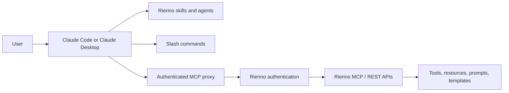

# Rierino Claude Plugin

## Rierino Claude Plugin

Rierino Claude Plugin connects Claude to the Rierino low-code development platform so teams can work with Rierino configurations, flows, schemas, UI definitions, rules, scripts, and AI assets directly from their AI-assisted development workflow.


**In brief:** Use this plugin when you want Claude to understand Rierino platform concepts and help you build, review, explain, or operate Rierino assets. It packages Rierino-specific skills, specialist agents, slash commands, and an authenticated MCP proxy for platform operations.


### At a glance

* Connects Claude Code and Claude Desktop to Rierino.
* Adds Rierino-aware development skills and specialist agents.
* Provides `/rierino-status` for platform connectivity checks.
* Provides `/rierino-mcp` for listing available MCP tools, resources, templates, and prompts.
* Uses an authenticated MCP proxy to reach Rierino REST and MCP endpoints.
* Discovers MCP capabilities dynamically from the connected Rierino server.
* Helps generate and maintain configuration-first assets such as schemas, queries, sagas, UIs, rules, handlers, templates, and AI agent definitions.

### Why it matters

Rierino is designed around configuration-first development for microservices, orchestration flows, internal applications, integrations, ML, GenAI, and AI agents. The Claude plugin brings that same model into Claude: instead of asking a generic assistant to guess Rierino conventions, you can use a plugin that already includes Rierino-specific instructions, standards, and task-focused agents.

This makes Claude more useful for:

* creating new Rierino assets from a business requirement,
* reviewing existing platform configuration,
* explaining complex flows in plain language,
* generating valid JSON configuration structures,
* producing transformation logic, templates, scripts, and test data,
* discovering available MCP tools and resources from a live Rierino environment.

### How it works



The plugin has four main parts:

| Component     | What it adds                                                                              | Why it is useful                                                            |
| ------------- | ----------------------------------------------------------------------------------------- | --------------------------------------------------------------------------- |
| **Skills**    | Task-specific instructions for building Rierino assets                                    | Keeps Claude aligned with Rierino conventions and expected output formats   |
| **Agents**    | Specialized assistants for schemas, queries, UIs, sagas, scripts, rules, agents, and more | Lets users delegate focused platform tasks to the right assistant           |
| **Commands**  | `/rierino-status` and `/rierino-mcp`                                                      | Gives quick connectivity and capability checks inside Claude                |
| **MCP proxy** | Authenticated bridge between Claude and the Rierino server                                | Enables live platform operations while keeping tool discovery server-driven |

### Included capabilities

#### Authenticated MCP proxy

The plugin includes a Node.js MCP proxy that bridges Claude's stdio-based MCP communication to a Rierino HTTP JSON-RPC MCP endpoint.

Key behavior:

* authenticates against the configured Rierino instance,
* forwards JSON-RPC MCP calls to Rierino,
* discovers tools at runtime instead of hardcoding tool definitions in the plugin,
* refreshes authentication tokens automatically,
* retries once after a `401` response by refreshing credentials,
* masks raw JWTs before responses are returned to Claude,
* uses built-in Node.js modules only, with no separate build step.


Do not commit Rierino credentials to source control. Prefer passing credentials through the MCP configuration `env` block or through a `.env` file stored outside the project folder. Add local MCP and environment files to `.gitignore` when they contain instance-specific values.


#### Rierino-aware skills

Skills provide reusable instructions for Claude. They tell Claude how to handle Rierino-specific structures, naming rules, data conventions, output formats, and task-specific requirements.

All skills follow the same general pattern:

1. Read the global conventions and operational rules.
2. Read the task-specific `SKILL.md` file.
3. Use any local references before making platform calls.
4. Return clean output that can be copied into Rierino or used by another workflow.

The plugin includes skills for:

| Skill                 | Use it for                                                         |
| --------------------- | ------------------------------------------------------------------ |
| `schema_builder`      | JSON Schema definitions and data model structure                   |
| `query_builder`       | Structured query definitions, filters, aggregations, and pipelines |
| `ui_assistant`        | Screen and UI configuration JSON                                   |
| `component_builder`   | React editor components for the page builder                       |
| `lister_builder`      | React list and lister display components                           |
| `code_assistant`      | Groovy scripts and JavaScript event handlers                       |
| `saga_assistant`      | Saga flow definitions for APIs, events, and workflows              |
| `template_assistant`  | Handlebars templates for storefront and experience layers          |
| `jmespath_assistant`  | JMESPath expressions and transformation pipelines                  |
| `element_assistant`   | SYSTEM Element configuration for integrations                      |
| `drools_assistant`    | Drools Rule Language rule generation                               |
| `test_data_generator` | Realistic mock JSON records for testing                            |
| `workflow_explainer`  | Human-readable explanations of saga flows                          |
| `ai_agent_assistant`  | Rierino AI agent configuration and design support                  |

#### Specialist agents

Agents are higher-level assistants that delegate to the matching skill. They are useful when a task needs multiple steps, interpretation, or iteration.

Examples:

| Agent                 | Typical request                                                                          |
| --------------------- | ---------------------------------------------------------------------------------------- |
| `schema_builder`      | “Create a customer profile schema with marketing preferences.”                           |
| `query_builder`       | “Build an aggregation query for monthly order revenue by channel.”                       |
| `saga_assistant`      | “Design an API flow that validates an order, calls inventory, and writes a reservation.” |
| `ui_assistant`        | “Generate an admin screen for editing product content.”                                  |
| `workflow_explainer`  | “Explain what this saga does for a business analyst.”                                    |
| `test_data_generator` | “Generate ten realistic records for this schema.”                                        |
| `ai_agent_assistant`  | “Design an agent that can look up product data and trigger a support workflow.”          |

#### Slash commands

The plugin adds commands that are available from Claude after installation.

| Command           | Purpose                                                                                                  |
| ----------------- | -------------------------------------------------------------------------------------------------------- |
| `/rierino-status` | Checks Rierino platform connectivity using health and ping-style requests.                               |
| `/rierino-mcp`    | Lists available MCP tools, resources, resource templates, and prompts from the connected Rierino server. |

Common verification flow:

```
/rierino-status
/rierino-mcp tools
```

#### Runtime MCP discovery

Rierino MCP tools are registered by the Rierino server and discovered at runtime. This means the plugin does not need to ship a fixed list of tools. As the connected Rierino environment exposes new tools, resources, prompts, or templates, Claude can discover them through the MCP list commands.

This is especially useful when your Rierino MCP server maps:

* saga flows as tools,
* prompts as reusable prompt assets,
* state managers as static resources,
* state managers as dynamic resource templates.

### How it fits into the Rierino development model

Rierino development commonly spans Devops, Configuration, Design, and Data Science assets. The Claude plugin supports work across all of these areas.

| Rierino area      | Plugin support                                                                                                     |
| ----------------- | ------------------------------------------------------------------------------------------------------------------ |
| **Devops**        | Build and explain sagas, API flows, workflow flows, scripts, and backend orchestration logic.                      |
| **Configuration** | Create and refine queries, business rules, dynamic handlers, JMESPath expressions, and reusable logic definitions. |
| **Design**        | Generate schemas, screen configurations, listers, UI components, templates, and admin experience assets.           |
| **Data Science**  | Help define AI agents, GenAI-related configurations, MCP-facing tools, mock data, and test scenarios.              |

### Example use cases

#### Build an API flow faster

Ask the `saga_assistant` to draft a saga from a business requirement. Then use `workflow_explainer` to produce a plain-language explanation for reviewers.

```
Create a saga that receives an order request, validates the customer, checks stock, creates a reservation, and returns a confirmation response.
```

#### Generate a schema and matching UI

Use `schema_builder` to define the data structure, then `ui_assistant` to create a matching admin screen.

```
Create a JSON Schema for a product bundle and then generate a Rierino admin UI for editing it.
```

#### Create transformation logic

Use `jmespath_assistant` when you need to reshape JSON between services, normalize API responses, or prepare data for a UI or template.

```
Transform this external product response into our internal product schema using JMESPath.
```

#### Discover live MCP capabilities

Use `/rierino-mcp` to inspect what the connected Rierino server currently exposes.

```
/rierino-mcp tools
/rierino-mcp resources
/rierino-mcp prompts
```

#### Create realistic test records

Use `test_data_generator` to produce varied, realistic payloads that match a schema or service contract.

```
Generate 20 test customers with realistic addresses, consent flags, and order summaries.
```

### Installation

#### Claude Code

Claude Code supports plugins through the plugin manager.

**Option A — Add the Rierino marketplace**

Open Claude Code and run:

```
/plugins
```

Add this marketplace source:

```
https://raw.githubusercontent.com/rierino-open/rierino-claude-plugin/main/.claude-plugin/marketplace.json
```

Then install:

```
rierino-development
```

**Option B — Install directly from the plugin URL**

Open Claude Code and run:

```
/plugins
```

Choose **Add Plugin from URL**, then enter:

```
https://raw.githubusercontent.com/rierino-open/rierino-claude-plugin/main/development/.claude-plugin/plugin.json
```

#### Claude Desktop

1. Open Claude Desktop.
2. Go to **Customize**.
3. Open **Personal plugins**.
4. Choose **Create plugin** or add a marketplace/repository source.
5. Add the repository:

```
rierino-open/rierino-claude-plugin
```

6. Install `rierino-development`.


After installation, restart Claude if the plugin commands do not appear immediately. Some Claude clients register plugin commands at startup.


### Configuration

The MCP proxy needs a Rierino base URL and credentials. The recommended approach is to pass credentials through the MCP server configuration rather than storing them inside the plugin folder.

Example MCP configuration:

```json
{
  "mcpServers": {
    "rierino": {
      "command": "node",
      "args": ["/absolute/path/to/rierino-claude-plugin/development/servers/rierino-mcp/proxy.js"],
      "env": {
        "RIERINO_BASE_URL": "https://your-instance.rierino.com",
        "RIERINO_USERNAME": "your-username",
        "RIERINO_PASSWORD": "your-password"
      }
    }
  }
}
```

For direct links back into the Rierino UI, also configure the UI base URL in a local project `.env` file:

```bash
RIERINO_UI_BASE_URL=https://your-instance.rierino.com
```

Suggested local ignore rules:

```gitignore
.mcp.json
.env
```

### Security model

The plugin is designed to keep authentication handling inside the MCP proxy process.

Important behavior:

* Rierino credentials are read by the proxy process.
* The proxy authenticates with Rierino and forwards MCP requests with the active token.
* JWTs returned by the backend are replaced with opaque handles before Claude sees them.
* Handles are backed by an in-memory AES-256-GCM token vault.
* The vault key is generated when the proxy starts and is not persisted.
* Access to platform operations is still governed by the connected Rierino environment and the configured user credentials.


The practical result is that Claude can work with Rierino capabilities through MCP without needing raw token values in the conversation context.


### Troubleshooting

| Problem                               | What to check                                                                                              |
| ------------------------------------- | ---------------------------------------------------------------------------------------------------------- |
| Plugin commands are not available     | Confirm the plugin is installed, then restart Claude.                                                      |
| MCP tools do not appear               | Run `/rierino-mcp tools` and confirm the MCP proxy path and credentials are correct.                       |
| Login fails with `401`                | Check `RIERINO_USERNAME`, `RIERINO_PASSWORD`, and the target `RIERINO_BASE_URL`.                           |
| Platform health check fails           | Run `/rierino-status`, then confirm the Rierino gateway is reachable from your machine.                    |
| Plugin seems outdated after an update | Remove and reinstall the plugin, then restart Claude. If needed, remove and re-add the marketplace source. |
| Token errors after restart            | Re-authentication is expected because the token vault key is generated per proxy process.                  |

### When to use this plugin

Use Rierino Claude Plugin when you want Claude to help with any of the following:

* building APIs, event flows, and workflow sagas,
* creating schemas and data contracts,
* designing admin screens and UI mappings,
* writing Rierino-compatible scripts and handlers,
* building structured queries and transformations,
* creating business rules and decision logic,
* explaining flows to technical and non-technical stakeholders,
* preparing realistic test data,
* exploring live MCP tools and resources,
* designing AI agents that use Rierino services as tools.

### Where to go next

* [Development](https://docs.rierino.com/quick-start/development) — understand how Rierino development apps fit together.
* [Built with ML & AI](https://docs.rierino.com/introduction/built-with-ml-and-ai) — learn how Rierino supports RAI, AI agents, MCP, A2A, and ML automation.
* [MCP Servers](https://docs.rierino.com/data-science/mcp-servers) — learn how Rierino exposes sagas, prompts, resources, and templates over MCP.
* [Rierino Claude Plugin on GitHub](https://github.com/rierino-open/rierino-claude-plugin) — view the plugin source, README, and latest installation instructions.
